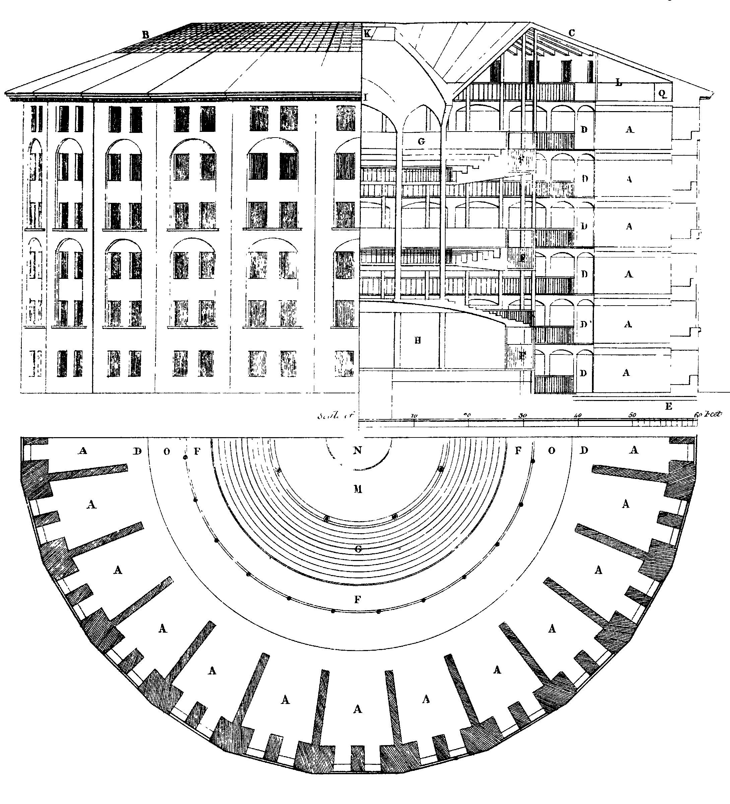

[bibliografía-1]: https://www.fcede.es/site/es/libros/detalles.aspx?id_libro=7333
[autores-1]: https://es.wikipedia.org/wiki/Zygmunt_Bauman
[bibliografía-2]: http://www.claveintelectual.com/titulos/el-imperio-de-la-vigilancia/
[autores-2]: https://es.wikipedia.org/wiki/Ignacio_Ramonet
[bibliografía-3]: https://www.planetadelibros.com/libro-vigilancia-liquida/112365
[autores-3a]: https://es.wikipedia.org/wiki/Zygmunt_Bauman
[autores-3b]: https://en.wikipedia.org/wiki/David_Lyon_%28sociologist%29
[bibliografía-4]: https://www.nostarch.com/androidsecurity
[autores-4]: https://nelenkov.blogspot.com.es/
[bibliografía-5]: https://www.megustaleer.com/libro/el-filtro-burbuja/ES0153104
[autores-5]: https://en.wikipedia.org/wiki/Eli_Pariser

[referencia-1]: https://www.thenation.com/article/snowden-exile-exclusive-interview/
[autores-r1a]: https://es.wikipedia.org/wiki/Katrina_vanden_Heuvel
[autores-r1b]: https://en.wikipedia.org/wiki/Stephen_F._Cohen
[referencia-2]: https://arstechnica.com/gadgets/2013/10/googles-iron-grip-on-android-controlling-open-source-by-any-means-necessary/
[autores-r2]: https://arstechnica.com/author/ronamadeo/
[referencia-3]: https://web.archive.org/web/20171108101350/https://android-developers.googleblog.com/2009/09/note-on-google-apps-for-android.html
[referencia-4]: https://www.wired.com/2013/10/replicant/
[autores-r4]: https://klintfinley.com/
[referencia-5]: http://www.wbur.org/bostonomix/2017/04/04/world-wide-web-inventor-future
[autores-r5]: http://www.wbur.org/inside/staff/asma-khalid
[referencia-6]: http://www.internetsociety.org/internet/what-internet/history-internet/brief-history-internet
[autores-r6a]: https://dl.acm.org/author_page.cfm?id=81100478842&coll=DL&dl=ACM&trk=0
[autores-r6b]: https://en.wikipedia.org/wiki/Vint_Cerf
[autores-r6c]: https://en.wikipedia.org/wiki/David_D._Clark
[autores-r6d]: https://en.wikipedia.org/wiki/Bob_Kahn
[autores-r6e]: https://en.wikipedia.org/wiki/Leonard_Kleinrock
[autores-r6f]: http://lynch.com/Dan_Lynch/Welcome.html
[autores-r6g]: https://en.wikipedia.org/wiki/Jon_Postel
[autores-r6h]: https://en.wikipedia.org/wiki/Lawrence_Roberts_(scientist)
[autores-r6i]: https://en.wikipedia.org/wiki/Stephen_Wolff


## Introducción

[wp-google-android]: https://es.wikipedia.org/wiki/Android
[wp-mozilla-firefox]: https://es.wikipedia.org/wiki/Mozilla_Firefox
[wp-prism]: https://es.wikipedia.org/wiki/PRISM
[wp-burbuja-de-filtro]: https://es.wikipedia.org/wiki/Burbuja_de_filtro

Este artículo pretende resumir el concepto de **privacidad**, relacionarlos con la sociedad moderna y la tecnología y establecer unas pautas básicas de protección de este derecho universal por medio de **modificaciones** en [dispositivos **Android**][wp-google-android] y en **navegadores web**, principalmente [Mozilla Firefox][wp-mozilla-firefox] por su apertura y amplias posibilidades de configuración.

Para conseguir el objetivo anterior, se hablará sobre la intromisión de las empresas multinacionales tecnológicas en nuestras vidas y de su relación con programas de **espionaje masivo** como el conocido [PRISM][wp-prism] por la NSA, la agencia de seguridad nacional de los Estados Unidos. También se hablará de **sociedad**, de las [**burbujas de filtros**][wp-burbuja-de-filtro] y de nuestra individualidad y **autonomía** personales.


### Por qué Google

[wp-jardín-vallado]: https://es.wikipedia.org/wiki/Jardín_vallado_(informática)

Por su alcance, posición y dominancia, se ha elegido Google como principal objetivo a observar y controlar.

Google ha ido conquistando poco a poco, y desde varios flancos a la vez, nuestra navegación en Internet y en la Web. Para muchos, Google ha sido **indistinguible** de Internet por la posición privilegiada de su buscador web. Además, desde el nacimiento de Android, Google ha salido de nuestras casas y oficinas para establecerse en nuestros **bolsos y bolsillos**. \
El objetivo de Google es estar en todos los sitios a la vez, y su negocio es conocernos lo máximo posible para ofrecernos publicidad sesgada y resultados de búsqueda personalizados.

<figure>


<figcaption>

Fuente: [Shenanigansen](http://owlturd.com/post/152110641819). [Se permite compartir](http://owlturd.com/about).

</figcaption>

</figure>

Al igual que Google, hay otros (pocos) grandes actores dominantes en Internet. Podríamos calificarlos como **señores feudales** que dominan con su superioridad tecnológica y económica el ciberespacio y establecen territorios con sus propias reglas, conocidos como [jardines vallados][wp-jardín-vallado]. Son los llamados **GAFAM**, acrónimo de Google, Amazon, Facebook, Apple y Microsoft.

<figure>


<figcaption>

Fuente: [De-google-ify Internet](https://degooglisons-internet.org/), un proyecto de [Framasoft](https://framasoft.org), una comunidad de voluntarios francófonos que promueve el software libre.

</figcaption>

</figure>


### Qué es la privacidad

El concepto de privacidad engloba un amplio espectro. Podemos recurrir a esta definición general por [Zygmunt Bauman][autores-1] (1925-2017), sociólogo y polaco, uno de los pensadores más influyentes de nuestro tiempo:

<figure>

> La privacidad es el ámbito que se supone de dominio personal, el territorio de la soberanía personal indivisa en cuyo interior uno tiene el poder completo e indivisible de decidir «qué y quién soy», y desde el cual cada uno puede intentar una y otra vez que sus decisiones sean reconocidas y respetadas.

<figcaption>

Zygmunt Bauman, <cite>[Daños colaterales](https://www.fcede.es/site/es/libros/detalles.aspx?id_libro=7333) (2011)</cite><br>También en <cite>[Vigilancia líquida](https://www.planetadelibros.com/libro-vigilancia-liquida/112365) (2013)</cite>

</figcaption>

</figure>

Si observamos con atención esta definición, podemos ver que la privacidad está fuertemente entrelazada con la **identidad**: la privacidad es, por tanto, el ámbito en el que nos **autodefinimos**, nos **autoafirmamos** y nos **autoproyectamos** antes de salir a la esfera pública.

Para proteger y mantener nuestra privacidad, debemos cuidar sus dos componentes más importantes: la **intimidad** y la **confidencialidad**.


#### Intimidad

[wp-panóptico]: https://es.wikipedia.org/wiki/Panóptico

La intimidad es el límite que se establece entre la cohabitación de lo público y lo privado. Cuando realizamos una acción que sabemos que puede ser observada y, por tanto, **juzgada** por otros, no la realizamos como individuo sino **como grupo**. Por contra, cuando realizamos una acción en nuestra intimidad, sabemos que no será observada y juzgada y la realizamos con plena confianza y autonomía; la intimidad, por tanto, asegura nuestra **individualidad** y **autonomía personal**.

Se puede ilustrar este concepto con el [panóptico][wp-panóptico]. El panóptico es un tipo de construcción carcelaria utilitarista que se desarrolló en el siglo XVIII. Se trata de una estructura circular de espacio diáfano y una torre central, en cuyo interior habita un guardián que puede ver todo el interior del edificio. Los prisioneros no saben cuándo son observados (no tienen intimidad) y se les induce un estado consciente permanente de supervisión que influye en cómo actúan. Se desarrolló como un método que permitiría el funcionamiento automático del poder con muy pocos recursos.

<figure>



<figcaption>

Diseño del panopticón de [Jeremy Bentham](https://es.wikipedia.org/wiki/Jeremy_Bentham). [Dominio público](https://commons.wikimedia.org/wiki/File:Panopticon.jpg).

</figcaption>

</figure>


#### Confidencialidad

La confidencialidad es la propiedad que garantiza que una información solo puede ser conocida por personas autorizadas. En resumen, es el control sobre el **acceso a una información**. Etimológicamente, el término viene del latín _confidentia_ y este de _confidĕre_, confiar. La confidencialidad es **confiar** una información de carácter personal con otra parte, esperando que la trate con honradez, bajo unos términos comunes.

La confianza habilita un espacio independiente con otra parte en la que intercambiar visiones, dudar y formar o reforzar opiniones e ideas. Al igual que la intimidad nos permite ser individuos, la confidencialidad nos permite **ser con los demás**. Es, por tanto, una parte integral de la **libertad** en sociedad.

Frases como _«quien oculta algo es que tiene algo que esconder»_ pretenden implicar que esconder es inherentemente malo, cuando el principal motivo de no hacer pública una información es protegerla del escrutinio externo vigente. Además, esconder es **vital** en ocasiones: las llamadas al número **016 de atención a las mujeres maltratadas** son ocultadas del historial de los teléfonos y del registro de llamadas del operador telefónico.

<figure>

> Cuando alguien dice: «No tengo nada que ocultar», en realidad está diciendo: «me río de mis derechos». [&hellip;] Si dejáis de defender vuestros derechos pensando: «No necesito mis derechos en este contexto», ya no se trata de derechos. Los habéis convertido en algo de lo que disfrutáis como de un privilegio revocable por el gobierno [&hellip;] Y ello reduce el perímetro de la libertad en el seno de una sociedad.

<figcaption>

Edward Snowden en <cite>[una entrevista de 2014](https://www.thenation.com/article/snowden-exile-exclusive-interview/) por [Katrina vanden Heuvel](https://es.wikipedia.org/wiki/Katrina_vanden_Heuvel) y [Stephen F. Cohen](https://en.wikipedia.org/wiki/Stephen_F._Cohen)</cite><br>Extraído de <cite>[El imperio de la vigilancia](http://www.claveintelectual.com/titulos/el-imperio-de-la-vigilancia/) (2016)</cite>, por [Ignacio Ramonet](https://es.wikipedia.org/wiki/Ignacio_Ramonet)

</figcaption>

</figure>


## Efectos sociales y espionaje masivo

Google es uno de los señores feudales de su jardín vallado, que con su posición privilegiada y su omnipresencia en nuestras vidas &mdash;presente en nuestros inseparables dispositivos Android, como entrada a Internet y con balizas invisibles en la totalidad de la Web&mdash; recoge información sobre nosotros y nuestro entorno y nos encierra en una burbuja de información que nos limita cognitivamente.


### Feudos digitales

[internet-gatekeepers]: https://www.ericsson.com/thinkingahead/the-networked-society-blog/2011/07/12/the-internets-gatekeepers/

La realidad actual de Internet difiere sustancialmente de aquellas ideas que dieron origen a la Web, creada para que los investigadores científicos intercambiasen información libremente. La proliferación de servicios empresariales privados, que posibilitaron la popularización de Internet, también lo han transformado. En la actualidad, los usuarios de Internet pasan la mayor parte de su tiempo en plataformas cerradas bajo el dominio de entidades o empresas privadas, lo que convergemos en llamar [jardines vallados][wp-jardín-vallado] o silos.

<figure>

> [La Web] fue diseñada para ser universal. El propósito era precisamente desmantelar los silos.

<figcaption>

[Tim Berners-Lee](https://es.wikipedia.org/wiki/Tim_Berners-Lee), inventor de la Web, [tras recibir el premio Turing](http://www.wbur.org/bostonomix/2017/04/04/world-wide-web-inventor-future) el pasado 30 de marzo de 2017

</figcaption>

</figure>

La totalidad de los principales **motores de búsqueda** (Google, Bing, Yahoo, Baidu, Yandex) se han convertido progresivamente en plataformas de este tipo, ofreciendo un catálogo amplio hasta el absurdo de servicios. La utilidad de los motores de búsqueda los convirtió en la puerta principal a la Web en los navegadores, y las empresas tras estos jardines vallados se consolidan como unos verdaderos [_gatekeepers_][internet-gatekeepers] o guardianes de Internet, gestionando **qué contenido mostrar en cada ocasión**. El auge de las **redes sociales** como primer contacto con Internet de los sectores de la población que con la penetración de los _teléfonos inteligentes_ ha convertido a otros jardines vallados, como Facebook o Twitter, en guardianes de Internet equiparables a los mencionados anteriormente.


<!-- TODO -->

Efecto «Hotel California»: https://digiday.com/marketing/navigating-hotel-california-effect-social-platforms/


### Seguimiento masivo

[balizas-clandestinas-en-aplicaciones-android]: https://theintercept.com/2017/11/24/staggering-variety-of-clandestine-trackers-found-in-popular-android-apps/

<figure>

> **Todo clic en una web** y todo toque en un teléfono inteligente puede desencadenar una amplia variedad de procesos ocultos de compartición de datos distribuidos entre un gran número de compañías y, como resultado, **modificar las opciones disponibles para una persona**.
>
> El seguimiento digital y la creación de perfiles, combinados con la personalización de contenidos, no solo se usan para monitorizar, sino también para influir en los comportamientos de las personas.

</figure>


### La burbuja de filtros

[wp-cass-sustein]: https://es.wikipedia.org/wiki/Cass_Sunstein
[wp-sesgo-de-confirmación]: https://es.wikipedia.org/wiki/Sesgo_de_confirmaci%C3%B3n
[wp-ingeniería-social]: https://es.wikipedia.org/wiki/Ingenier%C3%ADa_social_(seguridad_inform%C3%A1tica)
[hacking-político]: http://fusion.net/story/287086/this-is-the-scariest-sentence-you-will-ever-read-about-the-internet/
[elecciones-españa-2016]: http://www.elmundo.es/cronica/2016/07/03/57779fc0ca4741301d8b4609.html

En este espacio social, Internet, somos esclavos de una variedad de **feudos digitales** en los que no tenemos poder efectivo de decisión ni rescisión. Sus **señores feudales** compiten activamente por nuestra atención con intrincados filtros de información basados en los intereses que infieren de nuestra actividad en sus dominios. Estos filtros nos exponen **exclusivamente** a información y opiniones afines a las nuestras. Este sesgo nos desvincula de facto de la realidad y nos encierra psicológicamente en un espacio tremendamente reactivo al cambio.

Ya en 2002 el profesor y abogado [Cass Sustein][wp-cass-sustein], dedicado especialmente a derechos sociales, observó:

<figure>

> Internet fomenta la fragmentación social al alentar a la gente a organizarse en enclaves cerrados para personas similares donde todo el mundo se refuerza mutuamente en sus ideas bloqueando puntos de vista diferentes u opuestos.

<figcaption>Cass Sustein</figcaption>

</figure>

Más tarde, en 2011, [Eli Pariser][autores-5] relaciona estas ideas con los algoritmos de personalización de contenidos y acuña el término **burbuja de filtros**, que desarrolla en su libro [_El filtro burbuja_][bibliografía-5]:

<figure>

> Los algoritmos de tipo corporativo, usados típicamente para determinar gustos o sugerir contactos, por ejemplo, podrían tener efectos en construir alrededor de cada persona compactas burbujas de contenido, aislándonos de todo el constructo de ideas que por ser diferentes quedan fuera de nuestro alcance y de nuestra mente.

<figcaption>Eli Pariser</figcaption>

</figure>

Este efecto explota nuestro [sesgo de confirmación][wp-sesgo-de-confirmación], y también favorece las condiciones en los medios de masas para el [hacking cognitivo][wp-ingeniería-social], que ya está siendo explotados por distintos **actores políticos** alrededor del mundo. Casos como los de [Latinoamérica][hacking-político] o también el de [España][elecciones-españa-2016] sirven de ilustración.


### El proyecto PRISM y la vigilancia masiva

<figure>

> Este es un país libre. **Nosotros** tenemos derecho a compartir **su** intimidad en un espacio público.

<figcaption>Peter Ustinov</figcaption>

</figure>


## Libera tu Android

Android **no es open source**, sencillamente. Tal como ya pasó con Google Chrome y el proyecto Chromium, Google y la Open Handset Alliance introdujeron Android como software libre y de código abierto, para luego distribuir un producto **comercial** y privativo. Una táctica de marketing maestra que, junto con usar Linux, atrajo la atención del sector geek y de la comunidad del código abierto.


### Diferencias entre Android y AOSP

[wp-servicios-de-google]: https://en.wikipedia.org/wiki/Google_mobile_services
[opengapps-paquetes-de-google]: https://github.com/opengapps/opengapps/wiki/Package-Comparison

Android no es solo un sistema operativo, sino un ecosistema controlado por Google. Se basa en su proyecto de software libre &mdash;este sí&mdash; llamado Android Open Source Project (AOSP), pero añade una suite de software propietario. Este software no-libre adicional se llama [**Servicios móviles de Google**][wp-servicios-de-google] (GMS, por sus siglas en inglés, aunque se les llama comúnmente GApps) y consiste en [un montón de aplicaciones y librerías][opengapps-paquetes-de-google] para interactuar con los servicios en internet de Google.

Esta suite incluye:

- **Google Play Store**: la única tienda oficial de aplicaciones. Buena suerte buscando aplicaciones confiables fuera de esta plataforma centralizada, donde Google marca convenientemente las reglas, y a la que no puedes acceder sin crearte una cuenta de Google.
- **Adaptadores de sincronización de Google**: para sincronizar contactos y calendarios con tu cuenta de Google.
- **Servicios de localización de Google**: usados por el sistema para determinar rápidamente la ubicación por redes móviles y wifi y para la ubicación _fused_ (redes + GPS).
- **GMail**, **Teclado de Google/GBoard**, **Google Fotos**, **Google WebView**, **Cámara de Google**, **Calculadora de Google** (!), **Contactos de Google**: _forks_ de las aplicaciones de código abierto de AOSP que son reemplazadas en dispositivos Android comerciales, en ocasiones añadiendo almacenamiento en los servidores de Google.
- **Google Now/Asistente**, **Google Chrome**, **YouTube**, **Google Maps**, Google Music, Google Drive/Docs... cualquier cosa Google _Algo_.

De hecho, la propia Google ha admitido que prácticamente [desarrolló Android para distribuir sus productos][referencia-3].


#### Una suite para dominarlos a todos

[aosp-sistema-de-permisos]: http://www.vogella.com/tutorials/AndroidPermissions/article.html
[google-play-services-instalación-masiva]: http://forums.whirlpool.net.au/archive/1987336
[wp-nokia-x]: https://es.wikipedia.org/wiki/Nokia_X_Software_Platform
[wp-fire-os]: https://en.wikipedia.org/wiki/Fire_OS


Algunas aplicaciones de los GMS están profundamente integradas en el sistema. No necesitan tu permiso explícito para casi nada porque el sistema confía en ellas por defecto. Son aplicaciones privilegiadas del sistema a las que implícitamente se les conceden los permisos declarados como `signatureOrSystem`.

Precisamente esa arquitectura dual de separación entre servicios del sistema y servicios de Google hace que el ecosistema de aplicaciones Android sea, cada vez más, un jardín vallado [menos libre con cada actualización][referencia-2]. Las guías de desarrollo y el IDE de Google instan a los desarrolladores a incluir en sus aplicaciones las librerías privativas de Google que hacen de puente para estos servicios (mapas de Google incrustados, notificaciones en tiempo real, etc), cuyas funcionalidades son listadas como parte de las novedades del sistema con cada nueva versión. Estas aplicaciones están capadas o directamente no funcionan en dispositivos con sistemas basados en AOSP pero sin GMS, lo que **reduce la competencia** viable de alternativas como [Nokia X][wp-nokia-x] o Amazon [Fire OS][wp-fire-os].


#### No eres el administrador de tu dispositivo

[wp-ingeniería-social]: https://es.wikipedia.org/wiki/Ingenier%C3%ADa_social_(seguridad_inform%C3%A1tica)

Al contrario que los sistemas operativos de ordenadores, Android solo expone una cuenta normal de usuario al _poseedor_ del dispositivo, con aplicaciones privilegiadas que te permiten realizar acciones como instalar otras aplicaciones, gestionar y configurar el hardware como el wifi o el bluetooth, tomar capturas, activar una VPN, etc. La cuenta de administrador real del dispositivo (`root` en Android, porque se basa en Linux) está **bloqueada**. Necesitas _rootear_ tu dispositivo para acceder a esta cuenta, que generalmente es un proceso opaco y turbio diferente para cada modelo y versión de Android, y que anula la garantía del fabricante, excepto para marcas muy específicas.

A nivel de seguridad, el modelo de no darle permisos completos al usuario es muy competente, porque pone trabas a que el usuario, por inconsciencia, ignorancia o porque [esté siendo engañado][wp-ingenería-social], se perjudique a sí mismo. Sin embargo, no proveer al usuario de un método de controlar su dispositivo con su propia voluntad lo prejuzga efectivamente como incompetente y le **deniega** la oportunidad de **aprender**. Además, lo somete a voluntades externas y difícilmente moderables, lo posiciona en un estrato social inferior y lo despoja de su propiedad en cuanto tiene la voluntad de realizar acciones que no se esperan de él.

En el tercer cuatrimestre de 2012, Google Play Store [instaló forzosamente la aplicación Servicios de Google Play][google-play-services-instalación-masiva] en todos los dispositivos Android en el mundo, sin pedir permiso a nadie, sin importar qué espacio disponible tuvieras **o tu voluntad** al desinstalarlo en repetidas ocasiones, porque volvía a reincidir. Esa en concreto fue mi epifanía personal. Evidenció que yo no controlaba mi propio teléfono, sino Google. Consideré que eso estaba **terriblemente mal** cuando había sido yo quien pagó por el teléfono, no lo alquilé ni lo tomé prestado de nadie. ¡Estaba incluso usando una ROM personalizada con acceso de superusuario!


### ROMs personalizadas y control

<figure>

> a sizeable amount of those surveyed weren’t using any Google Apps (mostly due to region-blocks, or privacy and ideological motivations). We will work hard to improve user experience for both types of users.

<figcaption>https://www.lineageos.org/Summer-Survey-Results/</figcaption>

</figure>


#### Falsificando los servicios de Google

https://microg.org


#### Comprobación de conexión y portal cautivo

[fuente-fairphone-community]: https://forum.fairphone.com/t/using-lineageos-on-the-fp2/28848/157
[fuente-xda-developers]: https://forum.xda-developers.com/showpost.php?p=58252752&postcount=38

[aosp-detección-portal-cautivo]: https://github.com/aosp-mirror/platform_frameworks_base/blob/master/services/core/java/com/android/server/connectivity/NetworkMonitor.java#L95
[aosp-lista-variables-adb]: https://github.com/aosp-mirror/platform_frameworks_base/blob/master/core/proto/android/providers/settings.proto#L228
[http-códigos-de-estado]: https://es.wikipedia.org/wiki/Anexo:C%C3%B3digos_de_estado_HTTP#2xx:_Peticiones_correctas

Para comprobar si hay conexión con internet cuando el dispositivo se conecta a la red, [AOSP comprueba][aosp-detección-portal-cautivo] si uno de los servidores de Google en California (http://connectivitycheck.gstatic.com/generate_204) devuelve un código HTTP 204 ([No Content][http-códigos-de-estado]).

Si se encuentra en una red abierta con portal cautivo, la red hijackea la petición y devuelve un código HTTP 30X para redirigir a una web propia, que se abrirá en un pequeño navegador emergente. Para no hacer conexiones a servidores de Google, se puede desactivar la comprobación ejecutando el siguiente comando mediante ADB:

```
$ adb shell settings put global captive_portal_mode 0
```

Esto, sin embargo, no te permitirá conectarte fácilmente a redes con portales cautivos, porque tendrás que abrir un navegador y replicar el comportamiento que AOSP hace automático. Si quieres mantener la comprobación, entonces puedes cambiar la dirección a la que el dispositivo hace la petición con los siquientes comandos mediante ADB (Android 7+):

```
$ adb shell settings put global captive_portal_http_url $URL
$ adb shell settings put global captive_portal_https_url $URL
$ adb shell settings put global captive_portal_fallback_url $URL
```

Puedes configurar tu propio servidor para que devuelva códigos HTTP 204. Para Apache con `mod_rewrite`, añade lo siguiente al fichero `.htaccess`:

```
<IfModule mod_rewrite.c>
  RewriteEngine On
  RewriteCond %{REQUEST_URI} /generate_204$
  RewriteRule $ / [R=204]
</IfModule>
```

Para nginx, añade esto directamente a la configuración:

```
location '/generate_204' {
  return 204;
}
```

Ejemplo de servidor de respaldo: http://noisyfox.io/generate_204 (HTTP); https://www.noisyfox.cn/generate_204 (HTTPS)


## Bibliografía

[comment]: <> (<span style="font-variant:small-caps">Apellidos del autor</span>, Nombre del autor. _Título del libro_. Número de edición. Lugar de publicación: editorial, año. Número de páginas. (Colección; número de la colección). Notas. ISBN xxxxxxxxxx.)

### Libros

- [<span style="font-variant:small-caps">Bauman</span>, Zygmunt][autores-1]. [_Daños colaterales: Desigualdades sociales en la era global_][bibliografía-1]. Traducción de Lilia Mosconi. Madrid: Fondo de cultura económica (Sociología), 2011. [ISBN 978-84-375-0669-2](https://es.wikipedia.org/wiki/Especial:FuentesDeLibros?isbn=9788437506692).
- [<span style="font-variant:small-caps">Ramonet</span>, Ignacio][autores-2]. [_El Imperio de la vigilancia_][bibliografía-1]. Traducción de Martín Sacristán. Madrid: Clave intelectual (Ensayo Social), 2015. 168 p. [ISBN 978-84-944338-2-5](https://es.wikipedia.org/wiki/Especial:FuentesDeLibros?isbn=9788494433825).
- [<span style="font-variant:small-caps">Bauman</span>, Zygmunt][autores-3a]; [<span style="font-variant:small-caps">Lyon</span>, David][autores-3b]. [_Vigilancia líquida_][bibliografía-3]. Traducción de Alicia Capel Tatjer. Barcelona: Ediciones Paidós (Estado y Sociedad), 2013. 176 p. [ISBN 978-84-493-2926-5](https://es.wikipedia.org/wiki/Especial:FuentesDeLibros?isbn=9788449329265).
- [<span style="font-variant:small-caps">Elenkov</span>, Nikolay][autores-4]. [_Android Security Internals: An In-Depth Guide to Android's Security Architecture_][bibliografía-4]. X: NoStarch Press, 2014. 432 p. [ISBN 978-1-59327-581-5](https://es.wikipedia.org/wiki/Especial:FuentesDeLibros?isbn=9781593275815).
- [<span style="font-variant:small-caps">Pariser</span>, Eli][autores-5]. [_El filtro burbuja: Cómo la web decide lo que leemos y lo que pensamos_][bibliografía-5]. Taurus (Pensamiento), 2017. 256 p. [ISBN 978-84-306188-3-5](https://es.wikipedia.org/wiki/Especial:FuentesDeLibros?isbn=9788430618835).


### Artículos

- [<span style="font-variant:small-caps">Vanden Heuvel</span>, Katrina][autores-r1a] y [<span style="font-variant:small-caps">Cohen</span>, Stephen F.][autores-r1b].
  [_Edward Snowden: A ‘Nation’ Interview_][referencia-1]. The Nation. [Publicación del 17 de noviembre de 2014](https://www.thenation.com/issue/november-17-2014/).
- [<span style="font-variant:small-caps">Amadeo</span>, Ron][autores-r2].
  [_Google’s iron grip on Android: Controlling open source by any means necessary_][referencia-2]. Ars Technica (Tech). 21 de octubre de 2013.
- Google developers.
  [_A Note on Google Apps for Android_][referencia-3]. Google Developers Blog. 25 de septiembre de 2009.
- [<span style="font-variant:small-caps">Finley</span>, Klint][autores-r4].
  [_The Quest to Build a Truly Free Version of Android_][referencia-4]. Wired (Business). 30 de octubre de 2013.
- [<span style="font-variant:small-caps">Khalid</span>, Asma][autores-r5].
  [_What The Founder Of The World Wide Web Thinks About The State Of The Web_][referencia-5]. Bostonomix. 4 de abril de 2017.
- [<span style="font-variant:small-caps">Leiner</span>, Barry M.][autores-r6a];
  [<span style="font-variant:small-caps">Cerf</span>, Vinton G.][autores-r6b];
  [<span style="font-variant:small-caps">Clark</span>, David D.][autores-r6c];
  [<span style="font-variant:small-caps">Kahn</span>, Robert E.][autores-r6d];
  [<span style="font-variant:small-caps">Kleinrock</span>, Leonard][autores-r6e];
  [<span style="font-variant:small-caps">Lynch</span>, Daniel C.][autores-r6f];
  [<span style="font-variant:small-caps">Postel</span>, Jon][autores-r6g];
  [<span style="font-variant:small-caps">Roberts</span>, Dr. Lawrence G.][autores-r6h];
  [<span style="font-variant:small-caps">Wolff</span>, Stephen][autores-r6i].
  [_Brief History of the Internet_][referencia-6]. Internet Society, 1997.
