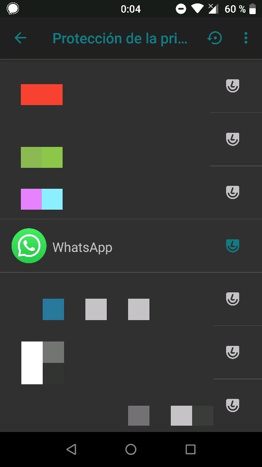
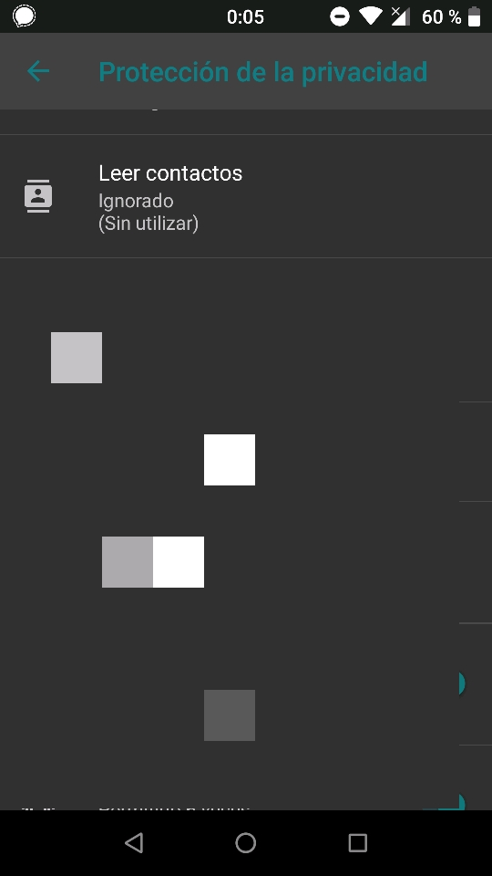
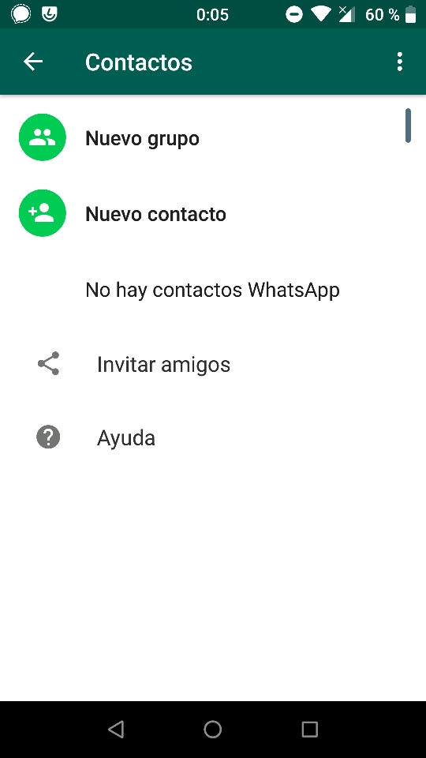

Ayer me pidieron en el [foro de Fairphone](https://forum.fairphone.com/t/los-15-1-trust-privacy-guard-grant-contacts-permission-but-pass-empty-contacts-list/42339) que desarrollase un comentario que hice sobre cómo utilizo algunas aplicaciones privativas, cerradas y, normalmente, [glotonas](https://en.wikipedia.org/wiki/Surveillance_capitalism) con respecto a tu información personal. Afortunadamente solo utilizo un puñado de ellas, pero [cualquier protección es poca]().

## Introducción a los permisos de Android

Primero, una pequeña introducción para entender esta característica y tener el modelo mental para poder utilizarla en nuestro beneficio.

La _Protección de la privacidad_ (_Privacy Guard_) data de los tiempos de CyanogenMod 4.4 Kitkat. Antes de Android 6 Marshmallow no se solicitaban permisos individuales por aplicación. El usuario concedía todos los permisos que una aplicación pedía en el momento de la instalación, o no la instalaba. Así que a la inteligente gente de CyanogenMod se le ocurrió que podía interceptar las peticiones que las aplicaciones dirigían al sistema y devolver datos falsos en lugar de los datos reales. Así, en vez de la lista de tus contactos, las aplicaciones recibirían una lista de contactos válida pero vacía, o en lugar de acceso a las cámaras del dispositivo, un mensaje de estado indicando que las cámaras estaban ocupadas por otra aplicación. De esa manera, las aplicaciones no fallarían, pero tampoco conseguirían información que el usuario no quiere que tengan.

A partir de Android 6, los permisos de nivel «peligroso» ya no se conceden en el momento de la instalación, sino en tiempo de ejecución, pidiéndole permiso directamente al usuario. Las aplicaciones ahora deben pedirlos individualmente _en el momento en que los necesiten_, y el usuario tiene la opción de concederlos o denegarlos. Pero las aplicaciones pueden reaccionar a la denegación, y entonces actuar de distinta manera. Algunas aplicaciones se niegan a funcionar cuando les deniegas alguno de los permisos que piden —una mala práctica que se ha ido mitigando desde entonces—, mientras que otras consideran algunos permisos indispensables para su funcionamiento —obviamente, una aplicación de cámara necesita acceso a la cámara, pero una aplicación cliente de correo electrónico puede funcionar sin acceso a tus contactos, mientras el usuario esté dispuesto a escribir manualmente las direcciones de sus recipientes.

Lineage OS es el sucesor de CyanogenMod, un sistema operativo Android alternativo y de código abierto para teléfonos móviles y tabletas. _Hereda_ la funcionalidad de _Protección de la privacidad_ de CyanogenMod.

**Resumen:** Antes de Marshmallow, no se podían conceder permisos granularmente en Android. A partir de Android 6 Marshmallow, la aplicación decide qué permisos son esenciales para su funcionamiento. Pueden, sin embargo, forzar al usuario a compartir datos que no son estrictamente necesarios.

## El caso: WhatsApp

WhatsApp, una aplicación de mensajería centralizada, de código cerrado, comprada por Facebook que incluso los defensores de la privacidad nos vemos obligados a utilizar en muchos casos (_gracias_, [efecto red](https://es.wikipedia.org/wiki/Efecto_de_red), 😒). Como muchos de vosotros sabéis, esta aplicación utiliza los números de teléfono como identificadores de usuario, así que no tienes que compartir tu dirección `privacidadeslibertad@servicio.com` con alguien, _solamente_ tu número, y la aplicación construye la dirección `<prefijo_nacional><número_teléfono>@s.whatsapp.net` de forma transparente (yo diría opaca).

El tema: la aplicación lee periódicamente **tu lista de contactos** y la guarda en sus servidores (la mal llamada «nube») para construir la sublista de personas que puedes contactar mediante su servicio. Naturalmente, pide el permiso de «leer contactos», y si se lo deniegas, se niega a funcionar. Pero el truco aquí es que **puedes recibir perfectamente mensajes de otras personas** sin ningún problema (la gente cuyo número no tienes guardado puede mensajearte si tienen el tuyo). ¡Privacy Guard al rescate!

**Resumen:** WhatsApp se niega a funcionar si le deniegas el permiso de «leer contactos». Nada impide a la aplicación recibir mensajes de otras personas ni a ti interactuar con la conversación cuando eso pasa, solo la propia reacción de la aplicación, enfurruñada, cuando le deniegas el permiso.

## Engañando a WhatsApp con Privacy Guard

El plan: darle el permiso de «leer contactos» a WhatsApp para que nos deje en paz, pero darle una lista de contactos vacía con Privacy Guard.

Primero, asegúrate de tener la aplicación instalada. Después, activa Privacy Guard para la aplicación: ve a `Ajustes` → `Trust` → `Protección de la privacidad` → busca la aplicación en la lista y asegúrate de que el icono a la derecha está coloreado:

Después, mantén pulsado la entrada de WhatsApp en la lista. Te llevará a las opciones de Protección de la privacidad para la aplicación. Después busca la opción «Leer contactos», tócala y selecciona «ignorar». A partir de ahora, el sistema mandará una lista vacía de contactos a la aplicación cuando pida contactos.

La próxima vez que la aplicación pida leer tus contactos, concédele el permiso. No te preocupes, la Protección de la privacidad te cubre las espaldas. Este es el truco: la aplicación pensará que has compartido tu lista de contactos. Pero no lo habrás hecho, en realidad, 😏:

## Desventajas

A partir de ahora, no verás los nombres de las personas en las conversaciones tal y como los tienes guardados en la agenda, sino solo sus números. Evita exponer tu lista de chats o una conversación abierta a cámaras u ojos ajenos para respetar la privacidad de tus contactos. **La privacidad se construye sobre la confianza**, y como cualquier otro enlace humano, es una **responsabilidad compartida**. Yo suelo utilizar [ObscuraCam](https://f-droid.org/app/org.witness.sscphase1) del Guardian Project cuando tengo que compartir algún pantallazo con datos personales (como mi lista de aplicaciones en los pantallazos de arriba).

WhatsApp no listará tus contactos, por lo que no podrás abrir nuevas conversaciones. Si sigues leyendo, abajo encontrarás varias maneras de hacerlo.

Por la misma razón, la pestaña de «Estados» no mostrará nada. Para mí es algo positivo porque considero que esa característica es intrusiva, molesta y absorbe tu atención contra tu voluntad.

### Advertencia: lo que descubrí gracias a la RGPD

La Regulación General de Protección de Datos de la Unión Europea introdujo la obligación a las empresas de dar a los usuarios de un servicio que lo soliciten un informe con los datos personales que tengan sobre él. El primer día de aplicación, solicité a WhatsApp este informe y, aunque ya llevaba meses engañando a WhatsApp, **no habían eliminado** (lo que creo que era) **la última lista de contactos** que compartí con ellos.

Así que, si ya has compartido tu lista de contactos con WhatsApp aunque sea una sola vez, solo conseguirás que no la **actualicen** (con nuevos contactos, números, nombres, etc.).

**Tarea pendiente:** solicitar a WhatsApp que eliminen permanentemente mi lista de contactos de sus servidores. Deberían hacerlo cumpliendo con la RGPD.

## Truco pro: abrir conversaciones con nuevos números de teléfono

Como se ha explicado arriba, una vez que impides que WhatsApp lea tu agenda de contactos, puedes recibir mensajes de otras personas e interactuar con las conversaciones ya abiertas, pero no puedes abrir nuevas desde la propia aplicación. Esta sección describe una solución que descubrí para abrir nuevas conversaciones por número (bueno, podrías simplemente utilizar [NoWhatOpen](https://f-droid.org/app/me.shrimadhavuk.numselapp), pero ¿qué diversión hay en eso?).

Las aplicaciones pueden reaccionar a ciertos enlaces ([URL](https://es.wikipedia.org/wiki/Localizador_de_recursos_uniforme)) cuando interactúas con ellos. WhatsApp usa esto para muchas cosas; una de ellas es para esos enlaces "Compartir mediante WhatsApp" que habrás encontrado en noticias o artículos por la Web. Pero también pueden usarse para abrir una conversación con un número concreto. Cuando abres un enlace de la forma `https://api.whatsapp.com/send?phone=<prefijo_nacional><número_de_teléfono>`, WhatsApp comprobará si ese número está registrado en su servicio y **abrirá su conversación**. Sencillo.

La manera en que yo lo uso es con el [lanzador de aplicaciones KISS launcher](https://f-droid.org/app/fr.neamar.kiss). KISS tiene una barra de búsqueda para contactos, aplicaciones, ajustes y para **buscar directamente en la Web**. Como hack, en `Ajustes de KISS` → `Selección de proveedores` → `Añadir proveedor de búsqueda`, puedes introducir `https://api.whatsapp.com/send?phone={q}` en el cuadro para la URL que buscaría en la Web, pero que provocará que WhatsApp abra esos enlaces. Una vez hecho esto, puedes escribir un teléfono en la barra de búsqueda (¡con el prefijo nacional!) para abrir directamente la conversación.

Normalmente busco el nombre de mi contacto, mantengo pulsado para copiar su número, y lo pego de nuevo en la barra para «buscar en WhatsApp». 😉

~
