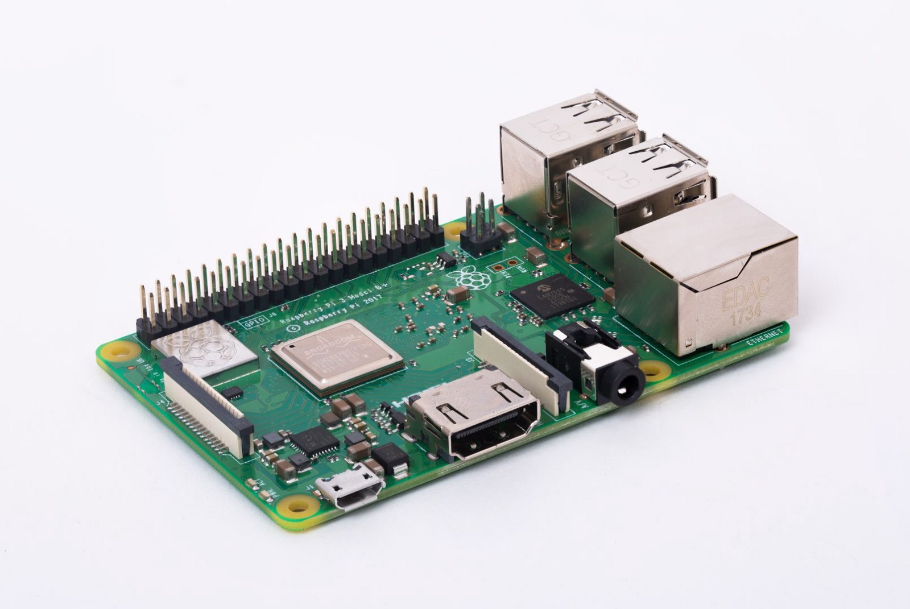
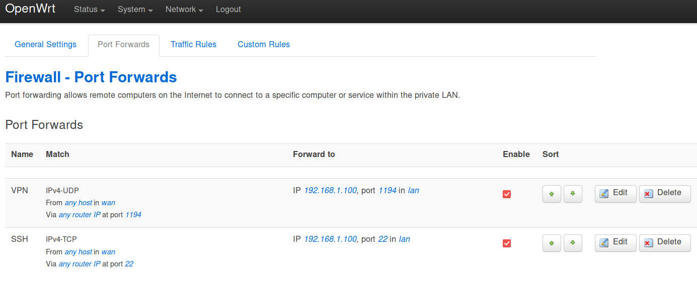
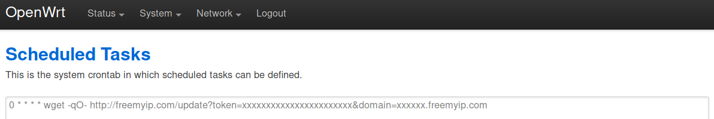
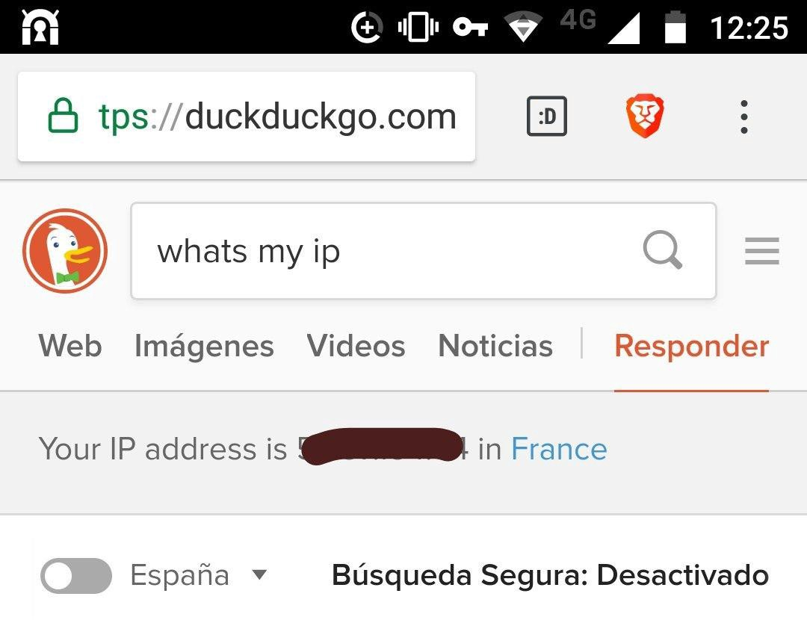

_Utilizar una VPN (red virtual privada) es una buena idea para asegurar tus conexiones a internet y, en algunos casos, proteger con ello la privacidad. Pero la verdad es que puede ser algo imponente instalar una. [**Luis de Dios**][luisddm-twitter] se ha currado una completa guía de instalación con PiVPN en [su blog][luisddm-blog] que resolverá todas las dudas posibles en el proceso. Luis, a quien también conocí en [h4ckademy][h4ckademy], es un desarrollador frontend y coorganizador del [FrontFest][frontfest]. También se le puede encontrar por los [Open Source Weekends][osweekends]. Desde hace un par de años uso la misma configuración de VPN que él describe cuando me conecto a redes en las que no confío, lo que me permitió hacer [un par de mejoras][luisddm-tw-pivpn-mejoras] a la guía. Puedes encontrar la guía [aquí][luisddm-pivpn-original] o leerla a continuación. ¡Gracias por compartirla, Luis! ~_


[luisddm-twitter]: https://twitter.com/luisddm_ "luisδμ (@luisddm_) en Twitter"
[luisddm-blog]: https://medium.com/@luisddm/ "luisδμ - Medium"
[luisddm-pivpn-original]: https://medium.com/@luisddm/instala-tu-propia-vpn-en-una-raspberry-pi-o-en-un-vps-mediante-pivpn-e27bfd6ccf8a "Instala tu propia VPN en una Raspberry Pi o en un VPS mediante PiVPN"
[luisddm-tw-pivpn-mejoras]: https://twitter.com/luisddm_/status/1034729455552483330

[h4ckademy]: https://www.h4ckademy.com/
[frontfest]: https://frontfest.es/
[osweekends]: https://osweekends.com/


## 

Si has llegado hasta aquí, probablemente sepas [qué es una VPN](https://www.bestvpn.com/guides/what-is-vpn-beginners-guide/) y para qué la necesitas. Pero si no, no te preocupes: vamos a empezar con una pequeña introducción explicando qué es esto, para qué la queremos y qué herramientas utilizaremos. Posteriormente explicaremos cómo configurar nuestra [Raspberry](https://www.raspberrypi.org/) y nuestro router (o en su defecto un VPS), instalaremos PiVPN, y finalmente configuraremos un par de dispositivos para hacer uso de nuestra nueva VPN.

<figure>



</figure>


#### ¿Qué es una VPN?

Básicamente **es un túnel cifrado a través del cual podemos conectarnos a otra máquina, que a su vez será la salga a internet** de forma convencional y lleve a cabo nuestras peticiones de red. Es una forma de acceder a internet **ocultando el tráfico** a los nodos intermedios a través de los que se establece el túnel. Solamente podrán ver un flujo de bits cifrado.

Algunos de los casos de uso más habituales son:

  - **Acceder a internet libremente** desde lugares del mundo donde haya censura. Aunque ojo, porque algunos ISPs son capaces de identificar y bloquear VPNs aunque no puedan leer los datos que se están intercambiando.
  - **Ocultar la información de navegación** a los nodos intermedios, incluidos los del ISP. Pero cuidado, porque aunque todos los nodos por los que pase el túnel no puedan acceder al tráfico, el nodo por el que salimos a internet sí que va a poder verlo. **Una VPN provee privacidad, pero no anonimato**.
  - **Ocultar nuestros datos en redes potencialmente inseguras**, como por ejemplo redes inalámbricas abiertas al público, en las que de otro modo se puede esnifar fácilmente nuestro tráfico de red.
  - **Conectarnos a una red local privada remota** (por ejemplo, de nuestra empresa o nuestra casa) a la que no podemos acceder físicamente. Con una VPN podríamos acceder a los recursos de esa red de forma segura y salir a internet desde allí.

Hay decenas de [**servicios que ofrecen VPNs por unos pocos euros**](https://www.bestvpn.com/best-vpn-services/) al mes, o incluso de forma gratuita con ciertas limitaciones. Contratándolos podemos salir a internet por casi cualquier parte del mundo, pero tendremos que confiar en ellos (es decir, asumir que su infraestructura es realmente segura, que no actúan de mala fe y que no se aprovechan de los datos a los que tienen acceso) y además acatar sus restricciones.

Si tenemos una conexión a internet doméstica en la que confiamos, podemos instalar nuestra VPN local. De este modo podremos salir a internet desde nuestra casa aunque estemos en cualquier otra parte del mundo.


#### ¿Qué es OpenVPN?

Es una herramienta de software libre que **habilita conexiones cifradas punto a punto**, es decir, el túnel del que hemos hablado previamente. También soporta validación de usuarios remotos, de modo que sea necesario tener una cuenta con unas credenciales de acceso y no pueda usarla cualquiera.


#### ¿Qué es PiVPN?

<div style="float: right">


</div>

Es un asistente que nos permite **instalar y configurar rápida y fácilmente una VPN usando [OpenVPN](https://openvpn.net/)**. Provee una interfaz basada en [_ncurses_](https://en.wikipedia.org/wiki/Ncurses) que nos facilitará enormemente la vida y nos permitirá configurar todo en remoto mediante una sesión SSH.

[**PiVPN**](http://www.pivpn.io/) **está diseñado para sistemas operativos** [**Debian GNU/Linux**](https://www.debian.org/)**, y particularmente para** [**Raspbian**](https://www.raspberrypi.org/downloads/raspbian/)**.** Lo cual no significa que no sea posible instalar una VPN en otro tipo de sistemas, por ejemplo de tipo Arch, Slackware, RPM, etc., pero no lo podremos hacer con la facilidad que nos da PiVPN, porque deberíamos o bien modificar su código, o bien usar otras alternativas menos amigables, como configurar OpenVPN a mano tras instalarlo con el gestor de paquetes correspondiente.

Todo lo que se va a hacer en este manual está probado en **Raspbian Stretch (rev. junio 2018)** y en **Debian GNU/Linux 9 Stretch**. No obstante, es muy probable que funcione en versiones más antiguas de ambos, e incluso en derivados como Ubuntu, pero no está garantizado.

### 1a. Configuración previa (red doméstica)

Hay dos partes que tendremos que configurar: la propia Raspberry y el router. Partiremos de la base de que tenemos **una Raspberry con una tarjeta SD vacía**, así como **un router doméstico con un firmware de** [**OpenWRT**](https://openwrt.org/) cuyos datos de acceso conocemos. Además, si queremos conectarnos de forma inalámbrica, necesitaremos que la Raspberry sea al menos una _Model 3_ o añadirle un [dongle WiFI por USB](https://www.amazon.es/Edimax-EW-7811UN-Adaptador-Interfaz-negro/dp/B003MTTJOY/).

Sin embargo, instalar OpenWRT en el router es opcional. Antes de hacerlo, deberíamos **estar seguros de la compatibilidad del modelo exacto que tenemos e informarnos de si nuestro ISP necesita aguna configuración específica**. Podemos seguir adelante con el firmware propietario. La interfaz será algo distinta, aunque casi con total seguridad se podrá configurar igualmente.

#### Raspberry

Tendremos que instalar y configurar [**Raspbian**](https://www.raspberrypi.org/downloads/raspbian/), que es una versión adaptada de Debian GNU/Linux para arquitecturas ARM y optimizada para la Raspberry.

Empezamos **flasheando la imagen de Raspbian en nuestra tarjeta SD** con [Etcher](https://etcher.io/) o cualquier otra aplicación similar. Como vamos a acceder únicamente mediante línea de comandos, es más que suficiente con la versión _lite_.

Tras el flasheo, se habrán creado **dos particiones en nuestra SD: _boot_ y _rootfs_**. Extraemos la SD y la volvemos a introducir en nuestro ordenador para que ambas se monten automáticamente. Ahora vamos a editar algunos ficheros.

Por defecto no podremos [acceder a Raspbian por SSH](https://www.raspberrypi.org/documentation/remote-access/ssh/), pero este servicio quedará habilitado si **creamos un archivo vacío llamado _ssh_** en la raíz de la partición _boot_. Este fichero se eliminará tras el primer arranque, pero la configuración se copiará y SSH ya quedará habilitado permanentemente.

Otro archivo que debemos **crear en la raíz de _boot_ es _wpa_supplicant.conf_**, en el cual indicaremos la configuración de nuestra red WiFi, sustituyendo `MY_SSID` y `MY_PASSWORD` por nuestras credenciales. Este archivo también se borrará una vez que se lleve a cabo la conexión, ya que la configuración se copiará al sistema durante el primer arranque y ya no hará falta posteriormente. Si quisiéramos conectarnos más adelante a otra red diferente, tendríamos que crearlo de nuevo con una configuración actualizada.

```
# wpa_supplicant.conf (boot)

ctrl_interface=DIR=/var/run/wpa_supplicant GROUP=netdev
update_config=1
country=es

network={
 ssid="MY_SSID"
 psk="MY_PASSWORD"
 key_mgmt=WPA-PSK
}
```

Si en lugar de conectar la Raspberry por WiFi preferimos hacerlo mediante Ethernet, nos saltamos este paso.

Para poder conectarnos a la Raspberry dentro de nuestra red local vamos a tener que identificarla. Por defecto lo habitual será que **el DHCP del router sea el encargado de asignarle una IP dinámica,** que puede ser diferente en cada conexión. Pero necesitamos que sea **estática**, tanto para poder conectarnos a ella localmente como para que el router sepa a dónde apuntar el tráfico cuando accedamos desde fuera, como veremos más adelante.

**Editamos el archivo _/etc/dhcpcd.conf_ de la partición _rootfs_**. Como ejemplo, vamos a suponer que la conexión se hace por WiFi, que nuestra red local es la 192.168.1.0, que nuestra máscara de red es 255.255.255.0 y que nuestro router tiene la primera IP del rango, esto es, 192.168.1.1\. Además, usaremos los [DNS de Cloudfare](https://cloudflare-dns.com/es-ES/), aunque podemos usar también los de nuestro ISP.

```
# /etc/dhcpcd.conf (rootfs)

interface wlan0
static ip_address=192.168.1.100/24
static routers=192.168.1.1
static domain_name_servers=1.1.1.1 1.0.0.1
```

Si nos conectamos por Ethernet, la interfaz de red a configurar se llamará `eth0` en lugar de `wlan0`.

Ahora extraemos la tarjeta SD del ordenador, la introducimos en la Raspberry y la arrancamos. Si todo ha ido bien, **en un par de minutos estará arrancada y conectada a nuestra red local y podremos acceder a su línea de comandos** haciendo un SSH a la IP estática que le hemos asignado.

#### Router

Normalmente vamos a tener un router en casa, el cual tendrá **una única dirección IP pública y una red privada a la cual se conectan nuestros dispositivos**. Tendremos que habilitar el [**_port forwarding_**](https://es.wikipedia.org/wiki/Redirecci%C3%B3n_de_puertos), de modo que cuando apuntemos desde fuera a un determinado puerto de nuestra IP pública, este tráfico en realidad sea redirigido a la Raspberry.

En nuestro caso mapearemos el puerto **UDP/1194**, que es el que usará OpenVPN de forma predeterminada, y opcionalmente el puerto **TCP/22** si queremos acceder a nuestra Raspberry desde el exterior mediante SSH.

Podemos establecer esta configuración mediante la interfaz web o accediendo por SSH y [editando un archivo](https://wiki.openwrt.org/doc/howto/port.forwarding).

<figure>



<figcaption>Esta configuración se encuentra en Network > Firewall > Port Forwards si usamos OpenWRT.</figcaption>

</figure>

Por último hay que configurar el acceso externo. En una conexión doméstica es muy probable que **nuestro ISP haya otorgado al router una IP pública dinámica** que cambie cuando lo reiniciamos o de forma periódica. En este caso tendremos que hacer uso de algún **servicio de DDNS (Dynamic DNS).** En nuestro caso voy a recomendar [freemyip.com,](https://freemyip.com) tanto por facilidad de uso como por su privacidad (se hace en dos pasos y no requiere crear una cuenta de usuario).

Para que funcione, **deberemos** [**informarle de forma periódica y automática**](https://freemyip.com/help) **de cuál es nuestra IP pública**, normalmente mediante una petición HTTP GET. De este modo podremos seguir accediendo desde el exterior mediante un dominio de forma transparente, sin importarnos los posibles cambios. Este _polling_ lo podremos hacer desde la Raspberry, añadiendo el comando al _cron_ mediante `crontab -e`. Otra opción es que lo haga el propio router. Los que funcionan con OpenWRT permiten hacer esto mismo también desde la interfaz web.

<figure>



<figcaption>Configuración del crontab en System > Scheduled Tasks</figcaption>

</figure>

Si tuviéramos un dominio propio, o un subdominio, podemos usarlo redirigiéndolo al dominio que hemos obtenido en el DDNS mediante un [registro de tipo CNAME](https://en.wikipedia.org/wiki/CNAME_record).

En cambio, **si sabemos que nuestro ISP asigna al router una IP pública estática**, no haría falta usar un DDNS. Directamente apuntamos nuestro dominio personal a dicha IP, o usamos la IP sin más.

### 1b. Configuración previa (VPS)

Si no queremos tener una Raspberry permanentemente encendida en casa, podemos optar por un **VPS (_Virtual Private Server_)**, que es básicamente una máquina en la nube. Si elegimos esta opción, no vamos a tener que llevar a cabo toda la configuración de la Raspberry, ya que lo único que tendremos que hacer es **instalar Debian GNU/Linux.** Tampoco habrá que hacer nada de lo que hemos hecho con el router, ya que normalmente la IP de la máquina será pública y estática, podremos asignarle un DNS que no necesitaremos actualizar, y el puerto 22 estará seguramente abierto por defecto.

La contrapartida es que el VPS no es gratuito, y ya **no será una máquina que esté totalmente bajo nuestro control**. Tendremos que informarnos de las particularidades del servicio contratado. Es decir, puede haber limitaciones de tráfico u otras restricciones de uso.

Una opción barata, sencilla y que funciona bien para un uso personal es [OVH](https://www.ovh.es/vps/).

### 2. Instalación de PiVPN

Una vez establecida la conexión SSH con nuestra Raspberry o VPS, procedemos a **instalar** [**PiVPN**](http://www.pivpn.io/). Lo único que tendremos que hacer para empezar es ejecutar en línea de comandos:

```
$ curl -L https://install.pivpn.io | bash
```

Y seguir los pasos:

  - El asistente nos avisará de que necesitamos **una IP estática**, y nos ofrecerá establecerla si estamos en Raspbian. Como ya la hemos configurado, seguimos adelante con las opciones predeterminadas. También pedirá permiso para actualizar el sistema automáticamente y que seleccionemos el **usuario que almacenará los perfiles** que generaremos.
  - Al llegar a la sección de protocolos, **elegimos el UDP/1194**, que es el que está establecido por defecto y que redirigimos previamente en el router.
  - El siguiente paso es **elegir la fortaleza del cifrado**. La opción por defecto (2048-bit) es adecuada y suficiente. Hay que tener cuidado con la de 4096-bit, porque puede tardar muchísimo tiempo en generar las claves, especialmente en la Raspberry. De hecho, la de 2048-bit puede llegar tardar 10 o 15 minutos, así que hay que tener paciencia.
  - Una vez generadas las claves, nos preguntará por el **nombre de nuestro dominio o subdominio** (que ya configuramos antes), y por los **DNS** que queremos usar.

Con esto ya casi hemos terminado. Ahora solo queda **generar perfiles de conexión**, es decir, credenciales de acceso. Ejecutamos `pivpn add` e introducimos un nombre de usuario y una contraseña. Y ya tendremos nuestro primer fichero _ovpn_ en el directorio personal del usuario que especificamos antes. Este archivo contiene todos los datos que necesitaremos para usar la VPN.


### 3. Uso de la VPN

El primer paso será **obtener el achivo _opvn_ generado**, cosa que podremos hacer conectándonos por SFTP a la Raspberry o el VPS. Después, establecer la conexión con la VPN es casi inmediato.


#### En una máquina Linux

Instalamos OpenVPN mediante nuestro gestor de paquetes, tras lo cual introducimos en la línea de comandos:

```
sudo openvpn mi_archivo_de_config.ovpn
```

Nos pedirá la contraseña con la que lo generamos y se conectará. Mientras esté en ejecución, estaremos saliendo a internet a través de nuestra VPN.

También podemos efectuar la configuración importando el archivo desde la interfaz gráfica, pero esto depende del entorno que usemos ([GNOME](https://help.gnome.org/users/gnome-help/stable/net-vpn-connect.html.es), [KDE](https://askubuntu.com/questions/816641/kubuntu-16-04-plasma-5-connect-to-vpn#816824), [Unity](https://www.my-private-network.co.uk/ubuntu-ssl-setup/)…). En el panel de configuración de cada entorno suele haber un apartado de red donde se puede hacer esto.


#### En un móvil Android

Instalamos la aplicación [OpenVPN Connect](https://play.google.com/store/apps/details?id=net.openvpn.openvpn). Importamos el archivo _ovpn_ desde la app, introducimos la contraseña con la que lo generamos anteriormente, y nuestro móvil pasará a estar conectado a través de la VPN. Podemos verificarlo si aparece un icono de llave en la barra superior.

<figure>



<figcaption>Desde Android, saliendo a internet por algún punto de Francia (usando la VPN en el VPS)</figcaption>

</figure>


<hr />

#### Actualización 1

Si en lugar de utilizar el puerto UDP/1194 usáramos el TCP/443, la VPN será más difícil de censurar, ya que el tráfico se podría confundir con el del protocolo HTTPS. En realidad [se pueden usar técnicas avanzadas para discernir estos dos tipos de tráfico](https://www.bestvpn.com/guides/how-to-hide-openvpn-traffic-an-introduction/), pero censurar indiscriminadamente el TCP/443 supondría dejar sin acceso al usuario a una enorme parte de la web, que además crece día a día.


<hr />

#### Actualización 2

Aunque en Android se ha recomendado usar la aplicación OpenVPN Connect, existe una alternativa llamada OpenVPN for Android ([Google Play](https://play.google.com/store/apps/details?id=de.blinkt.openvpn) y [F-Droid](https://f-droid.org/packages/de.blinkt.openvpn/) que es de código abierto, al contrario que la primera.
