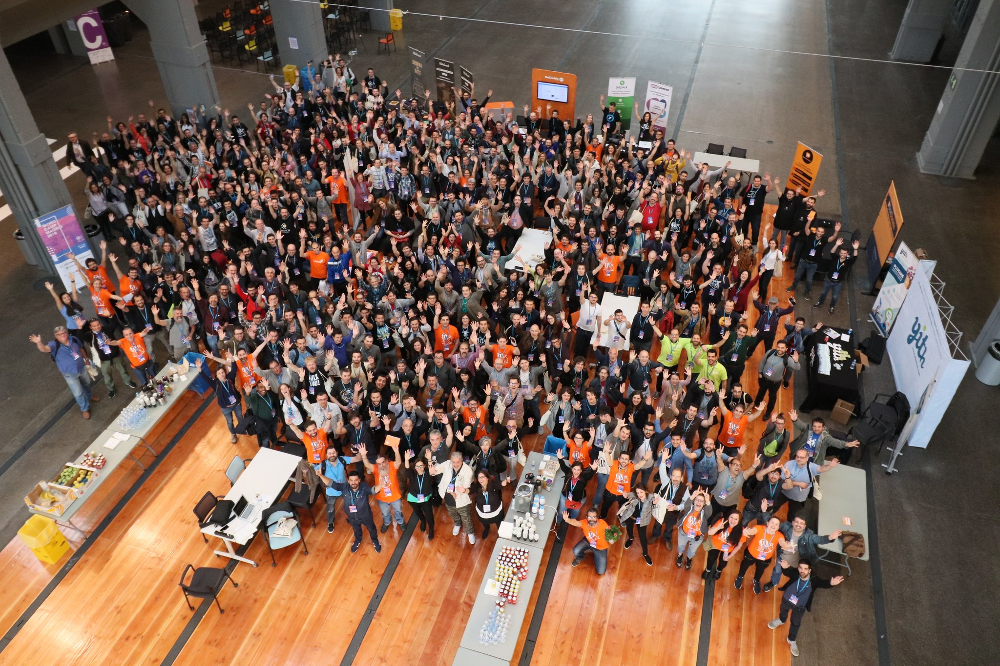
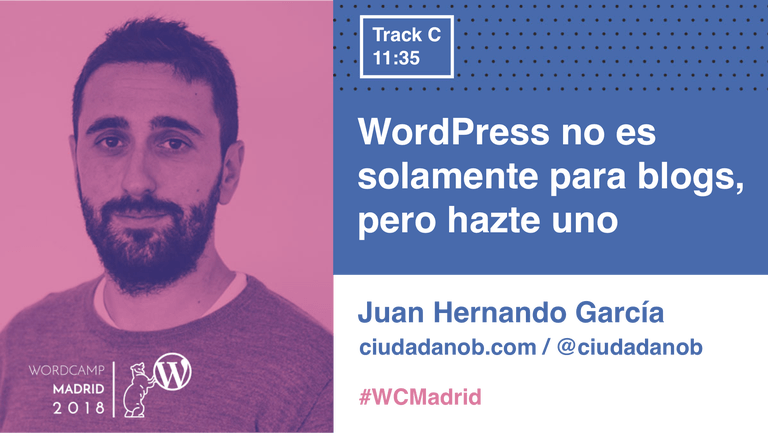
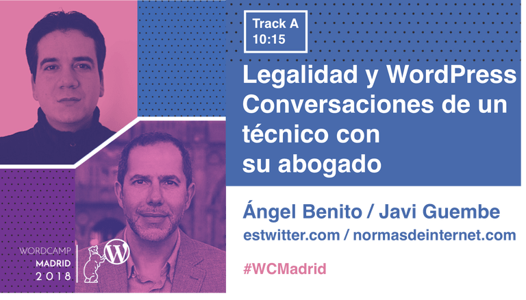
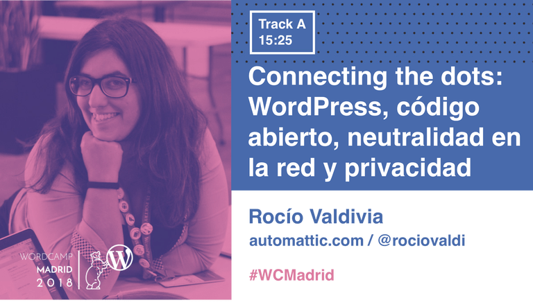

Con un madrugón de los que duelen, el sábado pasado asistí acompañado de mi buena amiga [Ester Legaz][ester-legaz] a la edición anual de la [WordCamp][wordcamp-madrid-2018] celebrada en Madrid, concretamente en [La Nave][la-nave], un excelente espacio del ayuntamiento.

Como cualquiera que lleve un tiempo metido en el mundillo de la tecnología, he asistido a múltiples y variadas charlas y talleres y también a algún congreso como la última edición del [FrontFest][frontfest], pero nunca había asistido a uno de **un tema que no es mi campo**. Como desarrollador, mi interés técnico está más centrado en el desarrollo _frontend_ puro y duro, mientras que WordPress se centra más en el desarrollo _backend_ y de la plataforma en sí. Y tengo que decir que ha sido una experiencia nueva y enriquecedora.

Todo empezó porque Juan Hernando (_@ciudadanob_) recomendó [la charla que no debíamos perdernos][ciudadanob-charla-que-no-te-debes-perder] en su blog (la suya, claro). Sigo su blog desde el año pasado porque comunica sincera y naturalmente temas en los que estoy realmente interesado. Y a partir de ahí descubrí que la WordCamp en realidad es un **congreso multidisciplinar** que reúne a técnicos, a diseñadores y a emprendedores y empresarios bajo el paraguas de **uno de los cinco proyectos de software libre más grandes** de la historia, [WordPress][wordpress-org], que compone el 30% de los sitios de la Web. Así que con [un programa tan variado como este][wordcamp-madrid-2018-programa], decidimos ir. Y también un poco porque daban chocolate con churros y porras.

## Las charlas

Personalmente, destaco tres de las charlas que pude ver:

[][wcm18-juan-hernando]  
Por supuesto, la charla de Juan Hernando, **_WordPress no es solamente para blogs, pero hazte uno_** ([transcripción aquí][ciudadanob-charla-indieweb]), que nos mostró la salud actual de la Web con tantas plataformas cerradas y nos hizo parte de la solución identificándonos como la _#ResistenciaWCMadrid_, la última esperanza de la Web, potenciadores del movimiento [IndieWeb][indieweb]: construir la Web de nuevo desde las personas.

[][wcm18-javi-guembe-ángel-benito]  
Como técnicos o personas que ofrecemos servicios por internet, tenemos la responsabilidad ineludible de respetar las normas de nuestros usuarios o clientes. La excelente y muy necesaria conversación entre [Javi Guembe][legalidad-y-wordpress-javig] (_@javiG_) y [Ángel Benito][legalidad-y-wordpress-albero] (_@albero_), **_Legalidad y WordPress: conversaciones de un técnico con su abogado_** ([presentación en PDF aquí][legalidad-y-wordpress-presentación]), nos dio un paseo por la [LSSI][wp-lssi] y su _ley de cookies_, la [LOPD][wp-lopd] española y el nuevo reglamento [RGPD][wp-rgpd] europeo, obligatorio el próximo 25 de mayo.

[][wcm18-rocío-valdivia]  
WordPress no es solo un producto. Tiene detrás toda la filosofía del software libre, tiene **una misión** detrás: la de liberar la publicación, la de democratizar la libertad de expresión. [Rocío Valdivia][rocío-valdivia] nos habló en su **_Connecting the dots: WordPress, código abierto, neutralidad en la red y privacidad_** del transfondo de WordPress, del porqué de su licencia [GPL][wp-gpl], de las comunidades, del futuro de internet si no se regana la neutralidad de la red y del papel de WordPress en la **educación digital**. Una charla esencial, como se señaló en el turno de preguntas, y que bien **podría haber sido la apertura** de la WordCamp por su amplio espectro.

**Otras charlas** que no puedo dejar de mencionar: la de [Santiago Jiménez][wcm18-santiago-jiménez] sobre la restructuración de la web de [Ágora Sol Radio][ágora-sol-radio], la radio autogestionada en la que mi amiga Ester participó emitiendo [Mentes Corrientes][mentes-corrientes]; la de [Pablo Moratinos][wcm18-pablo-moratinos] sobre el ciclo de un negocio y cómo potenciarlo con presencia online, que además fue muy divertida; y la de [Ibon Azkoitia][wcm18-ibon-azkoitia] sobre gestión del tiempo, de la que saqué un par de consejos útiles para mi día a día, pero con la que discrepo a la hora de planificar cada minuto de tus días, porque el [ocio es creativo][ol-el-arte-y-la-ciencia-de-no-hacer-nada].

## La mesa redonda

Al final del día, se habló del futuro de WordPress. Como era de esperar, la discusión giró en torno a [Gutenberg][wordpress-org-gutenberg], el futuro editor visual de contenido de WordPress que ha resultado ser bastante **polémico**.

La razón detrás de este nuevo editor es muy parecida a la del joven [editor visual de Wikipedia][wp-visual-editor]: para poder **llegar a un mayor público** que pueda contribuir, en el caso de Wikipedia, o publicar, en el caso de WordPress, se puede intentar solucionar la brecha tecnológica facilitando las tareas difíciles que por el momento requieren aprender a escribir en _wikimarkup_ (Wikipedia) o con _shortcodes_ o HTML (WordPress). En ambos proyectos el editor es retrocompatible y **se puede deshabilitar** temporal o permanentemente, aunque en el caso de WordPress el cambio conlleva una costosa actualización de _plugins_ y temas para ser compatibles con Gutenberg.

También parece ser que algunas personas consideran que la toma de la decisión de apostar por Gutenberg como futuro de WordPress no ha sido lo suficientemente asamblearia, como podría esperarse en un proyecto de software libre, sino que, por lo que le entendí a Rocío Valdivia, ha sido tomada por los programadores actuales del _core_ (también voluntarios). La discusión **recuerda a otros casos** de proyectos comunitarios grandes en los que se toman decisiones por la supervivencia del proyecto en sí, muchas veces con influencia del marco comercial, como cuando Mozilla decidió [parar el proyecto de Firefox OS][techcrunch-firefox-os-development-stopped] (`Boot2Gecko`).

Parece ser que llevará tiempo que la comunidad se reconcilie. De todas maneras, una de las grandes **ventajas del software libre** es que puedes coger el código actual y fundar un proyecto nuevo llevándote a parte de la comunidad si tienes la suficiente tracción, y que evolucionen en paralelo. En algunos casos, como con [OwnCloud][owncloud] y [NextCloud][nextcloud], uno de ellos [ganará por goleada][nextcloud-wins]. En otros casos, como con [OpenWrt][openwrt] y [LEDE][lede], los dos proyectos [se volverán a unir][openwrt-lede-merge]. En cualquiera de los casos, se necesita tiempo.

## Conclusión

Me quedé con ganas de ver alguna charla, como la de [los principios de Gestalt aplicados al diseño web][wcm18-piccia-neri], pero no se puede estar en dos sitios a la vez y no me puedo quejar de las que vi. Por suerte, nos informaron de que se subirán a [WordPress.tv][wordpress-tv].

Tengo que **felicitar al equipo organizativo** de la WordCamp Madrid. Aunque WordPress no sea mi campo, como he dicho al principio, ya tengo un ojo echado en la WordCamp Madrid del año que viene. Cuando encuentras algo así, bueno y de calidad, **no es una opción dejarlo escapar**.

~

[ester-legaz]: https://esterlegazfotografia.com/ "Ester Legaz, fotógrafa profesional en Madrid"
[la-nave]: http://www.lanavemadrid.com/ "La Nave Madrid"
[frontfest]: https://frontfest.es/ "FrontFest"
[wordpress-org]: https://wordpress.org/ "WordPress, software libre para crear webs, blogs o aplicaciones"
[wordpress-tv]: https://wordpress.tv/language/spanishespanol/ "WordPress TV"

[wordcamp-madrid-2018]: https://2018.madrid.wordcamp.org/ "WordCamp Madrid 2018"
[wordcamp-madrid-2018-programa]: https://2018.madrid.wordcamp.org/programa/ "Programa de la WordCamp Madrid 2018"
[wcm18-juan-hernando]: https://2018.madrid.wordcamp.org/session/wordpress-no-es-solamente-para-blogs-pero-hazte-uno/ "WordPress no es solamente para blogs, pero hazte uno - WordCamp Madrid 2018"
[wcm18-javi-guembe-ángel-benito]: https://2018.madrid.wordcamp.org/session/legalidad-y-wordpress-conversaciones-de-un-tecnico-con-su-abogado/ "Legalidad y WordPress: conversaciones de un técnico con su abogado - WordCamp Madrid 2018"
[wcm18-rocío-valdivia]: https://2018.madrid.wordcamp.org/session/connecting-the-dots-wordpress-codigo-abierto-neutralidad-en-la-red-y-privacidad/ "Connecting the dots: WordPress, código abierto, neutralidad en la red y privacidad - WordCamp Madrid 2018"
[wcm18-santiago-jiménez]: https://2018.madrid.wordcamp.org/session/del-blog-a-la-red-de-podcasts/ "Del blog a la red de podcasts - WordCamp Madrid 2018"
[wcm18-pablo-moratinos]: https://2018.madrid.wordcamp.org/session/quimica-para-tu-negocio-br-cn-fi-ev-wp/ "Química para tu negocio: Br Cn Fi Pr + WP - WordCamp Madrid 2018"
[wcm18-ibon-azkoitia]: https://2018.madrid.wordcamp.org/session/como-tener-un-proyecto-paralelo-y-no-quedarte-sin-vida-social/ "Cómo tener un proyecto paralelo y no quedarte sin vida social - WordCamp Madrid 2018"
[wcm18-piccia-neri]: https://2018.madrid.wordcamp.org/session/una-introduccion-practica-a-los-principios-gestalt-aplicados-al-diseno-web/ "Crea una UI rompedora con los principios básicos de Gestalt aplicados a diseño web - WordCamp Madrid 2018"

[ciudadanob-charla-que-no-te-debes-perder]: https://ciudadanob.com/blog/2018/03/21/que-charla-no-te-debes-perder-en-la-wordcamp-madrid/ "Blog de ciudadanoB: Qué charla no te debes perder en la WordCamp Madrid"
[ciudadanob-charla-indieweb]: https://ciudadanob.com/blog/2018/04/21/wordpress-no-es-solamente-para-blogs-pero-hazte-uno/ "Blog de ciudadanoB: WordPress no es solamente para blogs, pero hazte uno"
[indieweb]: https://indieweb.org/ "IndieWeb, una alternativa centrada en la gente a la Web comporativa"

[legalidad-y-wordpress-albero]: https://www.normasdeinternet.com/ "Ángel Benito Rodero"
[legalidad-y-wordpress-javig]: https://javig.es/legalidad-y-wordpress-en-wordcamp-madrid-2018/ "Javier Guembe: Legalidad y WordPress, en WordCamp Madrid 2018"
[legalidad-y-wordpress-presentación]: https://javig.es/wp-content/uploads/2018/04/legalidad-y-WordPress-WCMadrid2018.pdf "Presentación en PDF de Legalidad y WordPress: conversaciones de un técnico con su abogado"
[wp-lssi]: https://es.wikipedia.org/wiki/LSSI "Ley de Servicios de la Sociedad de la Información - Wikipedia en español"
[wp-lopd]: https://es.wikipedia.org/wiki/LOPD "Ley Orgánica de Protección de Datos de Carácter Personal (España) - Wikipedia en español"
[wp-rgpd]: https://es.wikipedia.org/wiki/RGPD "Reglamento General de Protección de Datos - Wikipedia en español"

[rocío-valdivia]: https://rocio.blog/ "Rocío Valdivia, Community Wrangler at Automattic"
[wp-gpl]: https://es.wikipedia.org/wiki/GPL "GNU General Public License - Wikipedia en español"

[ágora-sol-radio]: https://www.agorasolradio.org/ "Ágora Sol Radio: radio libre, autogestionada y asamblearia"
[mentes-corrientes]: https://www.agorasolradio.org/podcast/mentescorrientes/ "Mentes Corrientes en Ágora Sol Radio"

[ol-el-arte-y-la-ciencia-de-no-hacer-nada]: https://openlibrary.org/books/OL26419048M/El_arte_y_la_ciencia_de_no_hacer_nada "El arte y la ciencia de no hacer nada: el cerebro tiene su propio piloto automático (2013, Clave Intelectual)"

[wordpress-org-gutenberg]: https://wordpress.org/gutenberg/ "Gutenberg, una nueva experiencia de publicación (en inglés)"
[wp-visual-editor]: https://es.wikipedia.org/wiki/Wikipedia:Editor_Visual "Editor visual de Wikipedia"
[techcrunch-firefox-os-development-stopped]: https://techcrunch.com/2015/12/08/mozilla-will-stop-developing-and-selling-firefox-os-smartphones/ "TechCrunch (en inglés): Mozilla dejará de desarrollar y vender smartphones Firefox OS"

[owncloud]: https://owncloud.org "OwnCloud: tu propia nube (en inglés)"
[nextcloud]: https://nextcloud.com "NextCloud: plataforma libre de almacenamiento y colaboración (en inglés)"
[nextcloud-wins]: https://civihosting.com/blog/nextcloud-vs-owncloud/ "NextCloud vs OwnCloud (en inglés)"
[openwrt]: https://openwrt.org "OpenWrt: liberación de routers (en inglés)"
[lede]: https://lede-project.org "LEDE project (redirige a OpenWRT)"
[openwrt-lede-merge]: https://forum.openwrt.org/viewtopic.php?id=72940 "Anuncio de la unificación de los proyectos OpenWrt y LEDE en el foro de OpenWrt (en inglés)"
