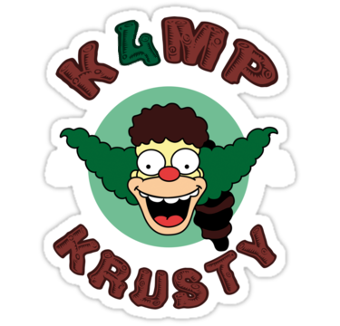

El fin de semana pasado, la comunidad de [h4ckademy](http://h4ckademy.com) nos reunimos en una casa rural en Pedrezuela, Madrid. ¿La premisa? Compartir conocimiento y experiencias personales en forma de una **conferencia privada e informal** en la que todos participamos con una intervención de 25 minutos.

<!--more-->

## El k4mpamento

Como ya adelanta el título, esta no es la primera vez que nos reunimos. El año pasado concurrimos en Villanueva de la Vera, Cáceres, donde hablé de [Unicode a través de los emoji](); el anterior, en Samboal, Segovia, donde defendí la [privacidad digital]() ([artículo]()); y la primera vez se organizó en La Cabrera, Madrid (esta me la perdí).

Pero en esta edición creo que **hemos conseguido un objetivo** que nos planteamos hace tiempo: que el grueso de las charlas no fueran charlas específicamente sobre el desarrollo o la informática. Y creo que estamos todos orgullosos porque hemos conseguido alcanzar una gran variedad de temas.

## Las charlas

Así pues, el sábado, como ya viene siendo costumbre, arrancamos con las charlas, que describo reducidamente a continuación:

1. **Jesús** nos presentó una breve [historia de la música electrónica](http://techno.org/electronic-music-guide/) para introducirnos de lleno en los distintos géneros de la música _techno_.
2. [**Said Atrahouch**](https://github.com/Afsoon) nos hizo una introducción a la lengua árabe, con todas sus &mdash;para nosotros&mdash; extravagantes reglas de concordancia y su rico mundo de dialectos.
3. [**Daniel Baena**](https://twitter.com/dani_baena) nos dijo que [estamos todos locos](daniel-baena_you-re-all-crazy_2019.pptx) &mdash;sin excluírse&mdash; y nos instruyó en lo que significa la salud mental. Según la <abbr title="Organización Mundial de la Salud">OMS</abbr>, el 9% de los adultos en España sufre alguna enfermedad mental y un 15% los sufrirá en su vida.
4. **Fernando** nos trajo la charla más singular, sobre cómo crear un estilo de peinado personalizado según la morfología de nuestro rostro, y nos presentó la técnica psicomorfológica del visagismo. Acurrucado a sus pies, su fiel perro Sultán.
5. **Elena** inauguró los temas [tinfoilistas]() describiendo cómo está diseñado el sistema operativo [QubesOS](https://www.qubes-os.org/) y enseñándonos a usar sus [_qubos_](https://www.qubes-os.org/doc/disposablevm/) con cabeza.
6. **Paula** volcó todos los mitos existentes sobre las <abbr title="Organización No Gubernamental">ONG</abbr> y los fue rebatiendo uno a uno. Es peligroso, contraproducente e injusto [juzgar por sus ovejas negras](https://falacias.escepticos.es/index.php/generalizacion-apresurada/) a todas estas organizaciones. 
7. Y **James** nos habló del muy tinfoilista diseño de cárceles panópticas, de por qué le da tanto mal rollo la Comisaría General de Extranjería y Fronteras de Aluche y de cómo encontramos estos principios de diseño en las redes sociales. 

Tras el descanso de mediodía para disfrutar de la estupenda paella de Fernando, continuamos con el resto de intervenciones:

8. [**Carlos Padial**](https://surreal.asturnazari.com) nos habló de [telepresencia por radiocontrol](carlos-padial_telepresencia.txt), nos enseñó a distinguir drones de multicópteros y, durante todo el fin de semana, nos dio viajes aéreos con sus cuadricópteros y unos cascos de telepresencia.
9. [**Borja de Régil**](https://ergl.github.io/) &mdash;en su charla titulada como [la frase de Marshall McLuhan](https://es.wikipedia.org/wiki/El_medio_es_el_mensaje)&mdash; nos habló de la influencia de los medios en la sociedad y también de [por qué odiamos (en) Twitter](https://jasonlefkowitz.net/2013/02/i-kind-of-hate-twitter/).
10. **Francisco** nos explotó la cabeza con su charla-taller de memoria, en el que nos demostró prácticamente que éramos capaces de memorizar una lista de quince palabras si lo hacíamos _engañando_ correctamente al cerebro.
11. **Luis** nos habló del arte de la improvisación, de cómo se aprende y ensaya la espontaneidad y de los fundamentos universales de la narrativa.
12. [**Ramón Guijarro**](http://soyguijarro.com) mandó al carajo la pirámide alimentaria de los 80 para presentarnos el [plato de Harvard](https://www.hsph.harvard.edu/nutritionsource/healthy-eating-plate/translations/spanish/) y nos informó sobre la importancia del descanso, de disfrutar la luz natural del día y del movimiento y el ejercicio cotidiano para la salud física y mental.
13. En mi turno, hablé de [la preservación de la cultura, los derechos de autor y los videojuegos]() para terminar con la historia real de cómo se preservó la voz artificial de un afamado físico gracias a un emulador de _software_ libre.
14. [**Israel Gutiérrez**](https://www.israelgutierrez.es) condenó a los programadores informáticos a una pronta extinción por los avances de las interfaces para usuarios legos y, con ello, refutó la necesidad de los «ingenieros 10x».
15. Y, por último, **Álex** cerró el día compartiendo el aprendizaje personal y laboral que ha adquirido de su experiencia arrancando y trabajando en un estudio de diseño durante los dos últimos años.

Por supuesto, no ha habido solo charlas en este fin de semana. Pero la barbacoa, los chapuzones, las partidas al [Secret Hitler](https://www.secrethitler.com/) y las serenatas de ocarina no se pueden describir, ;)

¡El año que viene más!

~