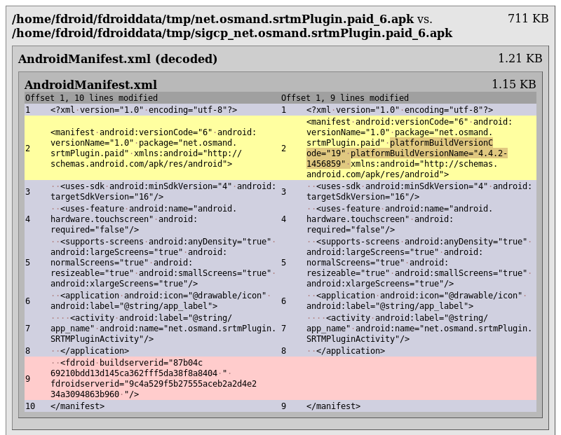
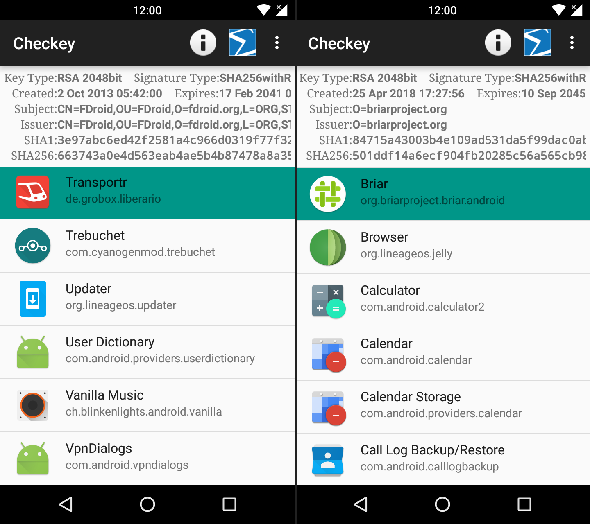

_La transparencia inherente al software libre permite a los usuarios verificar cómo está hecha una aplicación mediante el estudio de su código fuente. Pero no es suficiente para garantizar que la aplicación haga lo que dice salvo que la compiles tú mismo desde el código fuente. Nico Alt nos explica en este artículo los entresijos de las compilaciones reproducibles y los esfuerzos para llevarlas a F-Droid._

_[**Nico**](), colaborador habitual del proyecto F-Droid, es un apasionado del software libre al que conocí por una confusión de sobrenombres en el fediverso. Habla español tras vivir en Nicaragua, donde construyó la primera aplicación de transporte público del país, y me pidió ayuda para mejorar la traducción de este artículo. Siempre es una delicia ayudar a gente amigable y con tan buena disposición._

_¡Gracias por traducirlo y compartirlo, Nico! ~_

## Confiar está bien, pero controlar es mejor: aplicaciones reproducibles en F-Droid

Por Nico Alt, licencia . Artículos originales: [en español](https://nico.dorfbrunnen.eu/es/posts/2019/reproducir-fdroid/), [en inglés](https://nico.dorfbrunnen.eu/posts/2019/reproducibility-fdroid/) y [en alemán](https://nico.dorfbrunnen.eu/de/posts/2019/reproduzierbarkeit-fdroid/).

Gracias al software libre, los usuarios pueden verificar si una aplicación hace lo que dice. Pero solo algunas personas compilan software desde el código fuente. Por el contrario, la mayoría de las personas usan aplicaciones que obtienen de Google Play o la App Store de Apple, donde cada aplicación la compila su desarrollador, o de F-Droid, donde todas las aplicaciones las compila el propio proyecto. En los tres casos, hay que confiar en que las aplicaciones solo tienen lo que está accesible en el código público. Pero no es muy difícil modificar una aplicación antes de compilarla sin que nadie se dé cuenta. Es este el problema que resuelven las [compilaciones reproducibles](https://reproducible-builds.org). Si una aplicación se compila reproduciblemente, se puede saber si alguien la modificó o si se compiló directamente desde un código fuente determinado. De esta manera, los usuarios ya no tienen que confiar plenamente en los desarrolladores o en F-Droid. Cualquiera que tenga interés puede intentar reproducir la aplicación por sí mismo.

La meta de las compilaciones reproducibles es crear un método para verificar la conexión entre el código fuente y el archivo binario, o sea, el archivo final (la aplicación) que el usuario instala en su dispositivo. Contra toda lógica, compilar una aplicación varias veces desde el mismo código fuente no resulta en los mismos archivos binarios la mayoría de las veces. En cada compilación, surgen diferencias en los binarios que no cambian el funcionamiento de la aplicación, pero que hacen imposible verificarla. Con suerte, es suficiente anotar las versiones de las herramientas de compilación (*build tools*). Pero hay casos que no se resuelven tan fácilmente.

Las compilaciones reproducibles no eran tan relevantes en el desarrollo de software hasta que, en los últimos años, varios proyectos de software libre han trabajado en ellas. Cuando se puede compilar software de una manera reproducible, se abren muchas posibilidades. Es por ejemplo mucho más fácil aceptar donaciones de potencia de cálculo o de infraestructura porque ya no hay que confiar totalmente en el hardware usado para compilar el software. F-Droid es un buen ejemplo: el repositorio de F-Droid [solo tiene aplicaciones que son software libre](https://f-droid.org/docs/Inclusion_Policy). Para evitar que los desarrolladores puedan modificar las aplicaciones antes de compilarlas, F-Droid compila todas las aplicaciones por sí mismo. Eso es, al mismo tiempo, su mejor punto fuerte y su punto más frágil: porque F-Droid realmente compila cada una aplicación ofrecida, el servidor de compilación tiene restricciones de seguridad muy altas y solo Ciaran Gultnieks –que fundó el proyecto hace nueve años– tiene acceso a este servidor. Este punto tan importante en la infraestructura de F-Droid también es su cuello de botella más grande y a menudo ocurre que las actualizaciones se atrasan.

_En esta imagen se puede ver cómo un pequeño texto (*hash*) hizo imposible reproducir la aplicación OsmAnd~. La imagen muestra los resultados de [diffoscope](https://diffoscope.org/), un software para comparar archivos binarios. A la derecha se puede ver que se añadió información sobre las herramientas de compilación usadas, que es muy importante para poder reproducir una aplicación._

Hay planes para mejorar la situación de F-Droid y todos se basan en la idea de las compilaciones reproducibles. Una posibilidad que se podría realizar inmediatamente fue la que [el autor de este texto recomendó a NewPipe](https://github.com/TeamNewPipe/NewPipe/issues/1981), una aplicación alternativa para YouTube. Consiste en lo siguiente: si se puede reproducir una aplicación, F-Droid puede incluir el archivo binario original del desarrollador. Cuando el proceso de actualizaciones de F-Droid se atrase por cualquier motivo, los desarrolladores de la aplicación pueden enviar una notificación a los usuarios para que actualicen a una nueva versión sin tener que esperar a F-Droid. Esto es posible porque el usuario no instaló la versión firmada de F-Droid, sino la del desarrollador, así que se puede descargar e instalar la actualización del desarrollador sin esperar a que F-Droid compile, firme y publique la nueva versión. El equipo de NewPipe quiere implementar este mecanismo en los próximos meses. Otro plan de medio a largo plazo es descentralizar la infraestructura de F-Droid completamente. Cuando la mayoría de las aplicaciones se compile de una manera reproducible, más contribuidores de F-Droid podrán usar su propia potencia de cálculo para intentar reproducir aplicaciones. Después de compilar una aplicación, ellos podrán anotar si pudieron reproducir la aplicación o no. En el caso de que una cantidad suficiente de servidores oficiales estén de acuerdo en que una aplicación fue compilada indiscutiblemente desde el código fuente oficial, se puede incluir la aplicación en el repositorio de F-Droid sin necesidad de esperar al actualmente único servidor.

Con todos estos avances, los usuarios podrían instalar pronto una aplicación desde F-Droid que [muchos ya están usando](https://forum.f-droid.org/t/signal-discussion-about-google-play-alternative/95) y que, por restricciones del desarrollador, hasta ahora no se podía incluir en el repositorio: Signal. Aunque hubo varios intentos, la aplicación de mensajería instantánea no está disponible en F-Droid. Desde que cambió su nombre anterior, TextSecure, la organización detrás de Signal no permite distribuir archivos binarios firmados por otras personas. Por esta razón, los usuarios tienen que confiar en que nadie modificó la aplicación. Si se pudiera reproducir la aplicación de Signal, cualquiera –incluyendo F-Droid– podría chequear que la aplicación no contiene software malicioso. F-Droid ofrece la infraestructura necesaria para hacerlo. Ahora es el turno de Signal de hacer posible reproducir la aplicación.

*La aplicación Checkey muestra detalles sobre las firmas de las aplicaciones instaladas. En esta imagen se puede ver que F-Droid firmó la aplicación Transportr (CN=FDroid), mientras que los desarrolladores oficiales fueron quienes firmaron la aplicación Briar (O=briarproject.org).*

Como usuario es difícil saber si una aplicación fue compilada de una manera reproducible o no. El principio de compilaciones reproducibles se popularizó en los últimos años y por esto aún no hay una opinión común sobre cómo se muestra que una aplicación es reproducible o no. Cuando se escribió este texto, solo había unas pocas aplicaciones reproducibles en el repositorio de F-Droid. Si se hubiera mostrado un aviso a los usuarios en estos días, muchos tendrían que ignorarlo para poder seguir usando F-Droid. Para no «quemar» este tema, por lo menos al inicio, F-Droid decidió no mostrar ninguna información sobre el estatus de reproducibilidad. F-Droid va a reconsiderarlo cuando las compilaciones reproducibles sean más populares y los diseñadores de experiencia de usuario (UX) hayan ultimado unas «buenas prácticas». Para cualquiera que aún esté interesado, hay dos opciones para encontrar más información. Una es la aplicación [Checkey](https://guardianproject.info/apps/info.guardianproject.checkey/), que muestra informaciones sobre las firmas de las aplicaciones instaladas. En estos días, la mayoría de las aplicaciones están firmadas con el certificado de F-Droid. Estas aplicaciones tienen el texto `CN=FDroid [...]` en la columna `Issuer` («expedidor»). Aplicaciones como Briar, que están en F-Droid con las firmas oficiales de sus desarrolladores, tienen otros textos, como por ejemplo `O=briarproject.org`. Otra opción para saber más es visitar la pagina web [verification.f-droid.org](https://verification.f-droid.org/). Todas las aplicaciones de F-Droid se compilan otra vez por este servidor y después se publica la información de si la aplicación fue reproducida con éxito o no. Desafortunadamente, no significa que si se pueda reproducir una aplicación se incluyan inmediatamente los archivos binarios de los desarrolladores. Para esto, los desarrolladores de las aplicaciones tienen que trabajar conjuntamente con F-Droid.

Las compilaciones reproducibles también son importantes en otras áreas aparte de en el software libre. Al igual que los desarrolladores de software libre, las empresas que crean software propietario pueden ser victimas de ciberataques ([\[1\]](https://thehackernews.com/2015/12/hacking-juniper-firewall-security.html), [\[2\]](https://ianduffy.ie/blog/2016/11/26/azure-bug-bounty-pwning-red-hat-enterprise-linux/), [\[3\]](https://www.rsa.com/en-us/blog/2017-02/kingslayer-a-supply-chain-attack)). Ya pasó varias veces que algún software malicioso infectó la infraestructura de las empresas de manera que se produjeron modificaciones de su software comercial durante el proceso de compilación. Para poder detectar y reducir el riesgo de ser elegido como objetivo de estos ataques, vale la pena dedicar tiempo a hacer reproducible el software. Cuando se tienen compilaciones reproducibles, varios servidores independientes puedan compilar un software y compararlo al final. Si todos tienen exactamente el mismo archivo binario, se puede estar muy seguro de que el software producido no tiene código malicioso. Por supuesto, solo es verdad si el código fuente tampoco tiene software malicioso. Por esto, el principio de las compilaciones reproducibles no reemplaza, sino que completa otros principios como pruebas de penetración (_pentesting_) o las auditorías de código. Una mejora totalmente diferente tiene lugar en el área de las actualizaciones diferenciales (_delta updates_). Con este tipo de actualizaciones, los usuarios solo descargan las partes diferentes entre distintas versiones de archivos binarios. Esto tiene el beneficio de que no se descarga todo el archivo y así se ahorran datos. Android usa actualizaciones diferenciales desde hace mucho tiempo y Microsoft las usa también. Desde Windows XP se llaman «archivos de instalación rápida». Cuando no es posible reproducir un software, ocurren modificaciones pequeñas con cada compilación que dan lugar a actualizaciones más grandes. Esta es una de las razones por las que Google también está interesado en hacer posible reproducir aplicaciones y la razón de que arreglase un problema persistente que impedía reproducir aplicaciones en Android.

-------------

No fue muy difícil reproducir aplicaciones en Android hasta que vino la versión 3.0.1 del plugin de Gradle. A partir de las siguientes versiones, ya no fue posible reproducir una aplicación en diferentes computadoras, porque el archivo `resources.arsc` se generaba diferente de una computadora a la otra. Uno de los desarrolladores de Briar, Torsten Grote, [reportó este problema a Google en junio de 2018](https://issuetracker.google.com/issues/110237303). Él estaba trabajando en reproducir la [aplicación de mensajería _peer-to-peer_](https://briarproject.org) para convertirla en la primera aplicación reproducible en F-Droid. No logró hacerlo porque la aplicación de transporte público [Öffi se le adelantó](https://f-droid.org/en/2018/08/16/twif-17-the-reproducible-builds-and-encrypted-e-mail-edition.html). Esto fue posible porque Öffi usó una versión antigua de Gradle que no tenía problemas a la hora de reproducir aplicaciones. Tres meses después, [Briar también entró a F-Droid](https://f-droid.org/en/2018/11/23/twif-31-a-look-at-app-rankings-and-briar-arrives.html) porque Grote encontró una solución alternativa usando un sistema de archivos que se llama [disorderfs](https://salsa.debian.org/reproducible-builds/disorderfs). Finalmente, en febrero de este año 2019, los desarrolladores de Google anunciaron que arreglaron el problema y que reproducir aplicaciones será posible con las próximas versiones 3.4 y 3.5 del plugin de Gradle. Ojalá que así más aplicaciones reproducibles entren a F-Droid.

-------------

En estos días, [varios proyectos diferentes](https://reproducible-builds.org/who/) trabajan en compilaciones reproducibles. Algunos de ellos son la [criptomoneda Bitcoin](https://github.com/bitcoin-core/docs/blob/master/gitian-building.md) y el [proyecto Tor](https://trac.torproject.org/projects/tor/wiki/doc/TorBrowser/Hacking#BuildingOfficialTorBrowserReleaseBinaries). Ambos proyectos han trabajado en hacer posible reproducir los archivos binarios que distribuyen. Con Bitcoin, varios desarrolladores independientes compilan una nueva versión y comparan si tienen el mismo resultado que otros desarrolladores. Solo si todos tienen el mismo resultado, ellos todos juntos firman el archivo binario. Cualquiera que tenga interés puede encontrar instrucciones con más detalles en las paginas web de los proyectos.

En Debian se anunciarion noticias tristes. En teoría, la versión más nueva (Buster) del sistema GNU tiene una cantidad muy grande de paquetes de software compilados reproduciblemente, con más del 90%. No obstante, uno de los desarrolladores de Debian, Holger Levsen, [reportó en un correo electrónico](https://lists.debian.org/debian-devel/2019/03/msg00017.html) que solo el 54% de los archivos binarios oficiales serán compilados de una manera reproducible. Esto es porque una gran cantidad de los programas fueron compilados antes de que se solucionasen problemas con la reproducibilidad en las herramientas de compilación. Ahora están pensando en [compilar todos los programas de nuevo](https://lists.reproducible-builds.org/pipermail/rb-general/2019-April/001549.html) para aumentar esta cantidad.

-------------

Reproducir una aplicación no siempre es fácil. A veces hace falta mucho trabajo para que se pueda compilar una aplicación de una manera reproducible. En cualquier caso, vale la pena. Hasta que se pueda reproducir e incluir las versiones originales de la mayoría de las aplicaciones de F-Droid, puede pasar algún tiempo más. Pero los fundamentos ya existen y ahora, en general, solo hay que resolver unos pequeños problemas y hablar con los desarrolladores de las aplicaciones para incluir los archivos binarios que ellos generan de su aplicación.

*Muchísimas gracias a [Roboe](https://virgulilla.com), que me ayudó bastante a mejorar mi traducción.*

### Enlaces

- [Documentación de F-Droid sobre servidores de verificación](https://f-droid.org/es/docs/Verification_Server/). Interesante si quieres reproducir aplicaciones tú mismo.
- [Documentación de F-Droid sobre aplicaciones reproducibles](https://f-droid.org/es/docs/Reproducible_Builds/). Más detalles sobre este tema.
- [Confianza, privacidad y software libre - F-Droid.org](https://f-droid.org/es/2019/05/05/trust-privacy-and-free-software.html). Artículo de [eighthave](https://forum.f-droid.org/u/hans), colaborador de F-Droid y de Guardian Project, que también trata sobre aplicaciones reproducibles.
