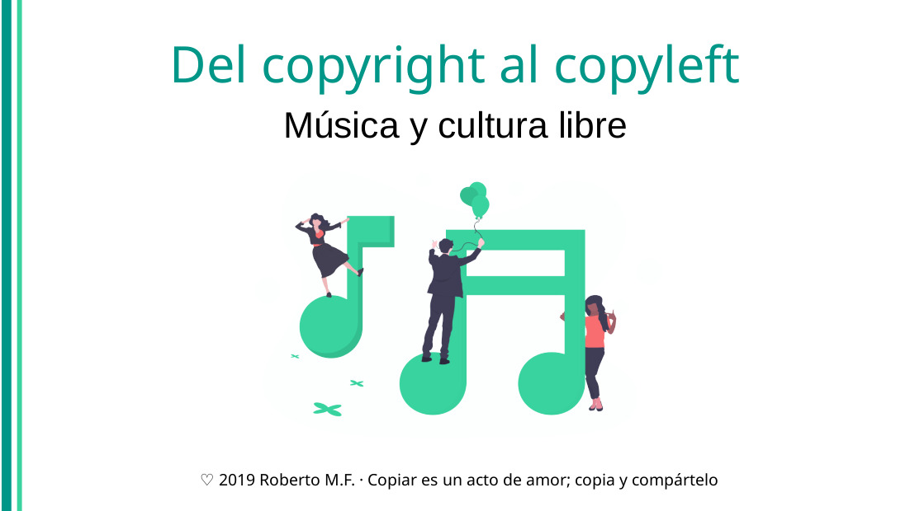

# 



<object
  type="application/pdf"
  data=""
  title="PDF de la presentación «Del copyright al copyleft: música y cultura libre»"
  style="display: flex; width: 100%; height: 22em; justify-content: center; flex-direction: column;"
>
  
  [Descarga las diapositivas en PDF desde este enlace.]()
</object>

Publiqué las notas de esta [charla que di en el RCSMM]() en tres artículos en este blog:

- Los derechos de autor históricamente y según la legislación española vigente. Puedes [leerlo aquí]( "Del copyright al copyleft, parte 1: derechos de autor").
- La cultura libre: qué es, cómo practicarla (licencias), qué proyectos musicales existen y cómo financiarla. Puedes [leerlo aquí]( "Del copyright al copyleft, parte 2: cultura libre y licencias").
- El software libre: la ética hacker, proyectos de software musical libre y la cláusula _copyleft_. Puedes [leerlo aquí]().