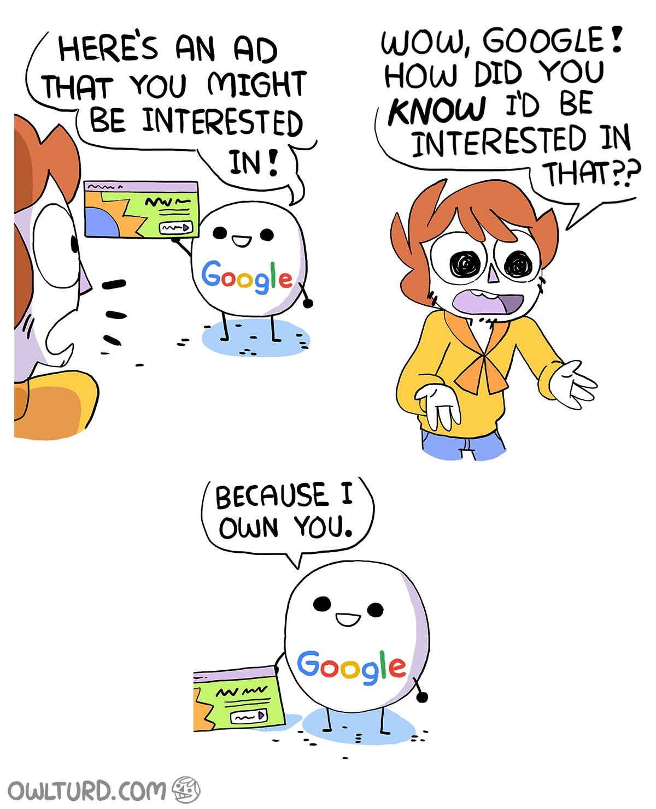

Un corto estudio sobre privacidad en el ámbito tecnológico y unas pautas para liberar dispositivos Android y proteger nuestra navegación web.

1. TOC
{:toc}

[bibliografía-1]: https://www.fce.com.ar/ar/libros/detalles.aspx?IDL=7117
[autores-1]: https://es.wikipedia.org/wiki/Zygmunt_Bauman
[bibliografía-2]: http://www.claveintelectual.com/titulos/the-forest/
[autores-2]: https://es.wikipedia.org/wiki/Ignacio_Ramonet
[bibliografía-3]: https://www.thenation.com/article/snowden-exile-exclusive-interview/
[autores-3a]: https://es.wikipedia.org/wiki/Katrina_vanden_Heuvel
[autores-3b]: https://en.wikipedia.org/wiki/Stephen_F._Cohen

## Introducción

[intro-1]: https://es.wikipedia.org/wiki/Android
[intro-2]: https://es.wikipedia.org/wiki/Mozilla_Firefox
[intro-3]: https://es.wikipedia.org/wiki/PRISM
[intro-4]: https://es.wikipedia.org/wiki/Burbuja_de_filtro

Este artículo pretende resumir el concepto de **privacidad**, relacionarlos con la sociedad moderna y la tecnología y establecer unas pautas básicas de protección de este derecho universal por medio de **modificaciones** en [dispositivos **Android**][intro-1] y en **navegadores web**, principalmente [Mozilla Firefox][intro-2] por su apertura y amplias posibilidades de configuración.

Para conseguir el objetivo anterior, se hablará sobre la intromisión de las empresas multinacionales tecnológicas en nuestras vidas y de su relación con programas de **espionaje masivo** como el conocido [PRISM][intro-3] por la NSA, la agencia de seguridad nacional de los Estados Unidos. También se hablará de **sociedad**, de las [**burbujas de filtros**][intro-4] y de nuestra individualidad y **autonomía** personales.

### Por qué Google

[porquégoogle-1]: https://es.wikipedia.org/wiki/Jardín_vallado_(informática)

Por su alcance, posición y dominancia, se ha elegido Google como principal objetivo a observar y controlar.

Google ha ido conquistando poco a poco, y desde varios flancos a la vez, nuestra navegación en Internet y en la Web. Para muchos, Google ha sido **indistinguible** de Internet por la posición privilegiada de su buscador web. Además, desde el nacimiento de Android, Google ha salido de nuestras casas y oficinas para establecerse en nuestros **bolsos y bolsillos**.  
El objetivo de Google es estar en todos los sitios a la vez, y su negocio es conocernos lo máximo posible para ofrecernos publicidad sesgada y resultados de búsqueda personalizados.

<cite>Fuente: [Shenanigansen](http://owlturd.com/post/152110641819). [Se permite compartir](http://owlturd.com/about){:rel="license"}</cite>

Al igual que Google, hay otros (pocos) grandes actores dominantes en Internet. Podríamos calificarlos como **señores feudales** que dominan con su superioridad tecnológica y económica el ciberespacio y establecen territorios con sus propias reglas, conocidos como [jardines vallados][porquégoogle-1]. Son los llamados **GAFAM**, acrónimo de Google, Amazon, Facebook, Apple y Microsoft.

Fuente: [De-google-ify Internet](https://degooglisons-internet.org/), un proyecto de [Framasoft](https://framasoft.org), una comunidad de voluntarios francófonos que promueve el software libre.

### Qué es la privacidad

La privacidad es generalmente un concepto muy amplio. Podemos recurrir a esta definición por [Zygmunt Bauman][autores-1] (1925-2017), que fue el sociólogo y pensador polaco más influyente de nuestro tiempo:

> La privacidad es el ámbito que se supone de dominio personal, el territorio de la soberanía personal indivisa en cuyo interior uno tiene el poder completo e indivisible de decidir «qué y quién soy», y desde el cual es posible lanzar y relanzar cruzadas con el fin de que se respeten y reconozcan las decisiones propias.
>
><cite>Zygmunt Bauman, [Daños colaterales][bibliografía-1] (2011)</cite>

Si observamos con atención esta definición, podemos ver que el concepto de privacidad está fuertemente entrelazado con el concepto de **identidad**: la privacidad es, por tanto, el ámbito en el que nos **autodefinimos**, nos **autoafirmamos** y nos **autoproyectamos** antes de salir a la esfera pública.

Para proteger y mantener nuestra privacidad, debemos cuidar sus dos componentes más importantes: la **intimidad** y la **confidencialidad**.

#### Intimidad

[intimidad-1]: https://es.wikipedia.org/wiki/Panóptico

La intimidad es el límite que se establece entre la cohabitación de lo público y lo privado. Cuando realizamos una acción que sabemos que puede ser observada y, por tanto, **juzgada** por otros, no la realizamos como individuo sino **como grupo**. Por contra, cuando realizamos una acción en nuestra intimidad, sabemos que no será observada y juzgada y la realizamos con plena confianza y autonomía; la intimidad, por tanto, asegura nuestra **individualidad** y **autonomía personal**.

Se puede ilustrar este concepto con el [panóptico][intimidad-1]. El panóptico es un tipo de construcción carcelaria utilitarista que se desarrolló en el siglo XVIII. Se trata de una estructura circular de espacio diáfano y una torre central, en cuyo interior habita un guardián que puede ver todo el interior del edificio. Los prisioneros no saben cuándo son observados (no tienen intimidad) y se les induce un estado consciente permanente de supervisión que influye en cómo actúan. Se desarrolló como un método que permitiría el funcionamiento automático del poder con muy pocos recursos.

<figure markdown="1">
  
  <figcaption>Diseño del panopticón de <a href="https://es.wikipedia.org/wiki/Jeremy_Bentham">Jeremy Bentham</a>. <a href="https://commons.wikimedia.org/wiki/File:Panopticon.jpg">Dominio público</a>.</figcaption>
</figure>

[quizá hablar de la intimidad como método para unir personas]

#### Confidencialidad

La confidencialidad es la propiedad que garantiza que una información solo puede ser conocida por personas autorizadas. En resumen, es el control sobre el **acceso a una información**. Por ejemplo, una conversación entre dos o más personas.

Explicar por qué la confidencialidad es integral para la libertad es complicado sin exponer de manera amplia cómo funcionamos en sociedad, explicación que excede los límites de este documento. Recurriré a un argumento en contra de la confidencialidad, un argumento a favor y un caso real y vigente de su importancia.

> Quien oculta algo es que tiene algo que esconder.

(implica que esconder es inherentemente malo)

> Cuando alguien dice: «No tengo nada que ocultar», en realidad está diciendo: «me río de mis derechos». [&hellip;] Si dejáis de defender vuestros derechos pensando: «No necesito mis derechos en este contexto», ya no se trata de derechos. Los habéis convertido en algo de lo que disfrutáis como de un privilegio revocable por el gobierno [&hellip;] Y ello reduce el perímetro de la libertad en el seno de una sociedad.
>
> <cite>Edward Snowden en [una entrevista de 2014][bibliografía-3] por [Katrina vanden Heuvel][autores-3a] y [Stephen F. Cohen][autores-3b], extraído de [El imperio de la vigilancia][bibliografía-2] (2016), [Ignacio Ramonet][autores-2]</cite>

Esconder es vital en ocasiones: las llamadas al número **016 de atención a las mujeres maltratadas** son ocultadas del historial de los teléfonos y del registro de llamadas del operador telefónico.

### Sociedad del control

#### La burbuja de filtros frente al _viejo_ Internet

> **Todo clic en una web** y todo toque en un teléfono inteligente puede desencadenar una amplia variedad de procesos ocultos de compartición de datos distribuidos entre un gran número de compañías y, como resultado, **modificar las opciones disponibles para una persona**.  
El seguimiento digital y la creación de perfiles, combinados con la personalización de contenidos, no solo se usan para monitorizar, sino también para influir en los comportamientos de las personas.

El control no se trata en muchas ocasiones de hacer que alguien haga algo específico, sino en de reducir las opciones de una persona para que no haga lo que querría.

[Quizá mencionar las _dark patterns_]

#### El proyecto PRISM y la vigilancia masiva

> Este es un país libre. **Nosotros** tenemos derecho a compartir **su** intimidad en un espacio público.
>
> Peter Ustinov
