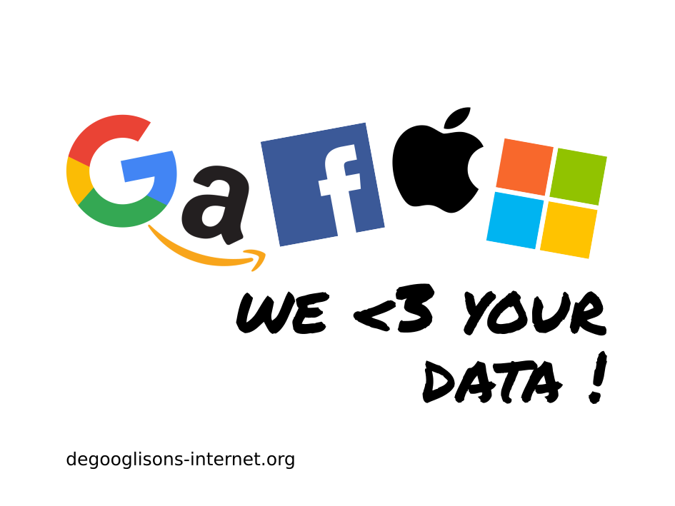

Un corto estudio sobre privacidad en el ámbito tecnológico y unas pautas para liberar dispositivos Android y proteger nuestra navegación web.

1. TOC
{:toc}

[bibliografía-1]: https://www.fce.com.ar/ar/libros/detalles.aspx?IDL=7117
[autores-1]: https://es.wikipedia.org/wiki/Zygmunt_Bauman
[bibliografía-2]: http://www.claveintelectual.com/titulos/the-forest/
[autores-2]: https://es.wikipedia.org/wiki/Ignacio_Ramonet
[bibliografía-3]: https://www.thenation.com/article/snowden-exile-exclusive-interview/
[autores-3a]: https://es.wikipedia.org/wiki/Katrina_vanden_Heuvel
[autores-3b]: https://en.wikipedia.org/wiki/Stephen_F._Cohen


## Introducción

[wp-google-android]: https://es.wikipedia.org/wiki/Android
[wp-mozilla-firefox]: https://es.wikipedia.org/wiki/Mozilla_Firefox
[wp-prism]: https://es.wikipedia.org/wiki/PRISM
[wp-burbuja-de-filtro]: https://es.wikipedia.org/wiki/Burbuja_de_filtro

Este artículo pretende resumir el concepto de **privacidad**, relacionarlos con la sociedad moderna y la tecnología y establecer unas pautas básicas de protección de este derecho universal por medio de **modificaciones** en [dispositivos **Android**][wp-google-android] y en **navegadores web**, principalmente [Mozilla Firefox][wp-mozilla-firefox] por su apertura y amplias posibilidades de configuración.

Para conseguir el objetivo anterior, se hablará sobre la intromisión de las empresas multinacionales tecnológicas en nuestras vidas y de su relación con programas de **espionaje masivo** como el conocido [PRISM][wp-prism] por la NSA, la agencia de seguridad nacional de los Estados Unidos. También se hablará de **sociedad**, de las [**burbujas de filtros**][wp-burbuja-de-filtro] y de nuestra individualidad y **autonomía** personales.


### Por qué Google

[wp-jardín-vallado]: https://es.wikipedia.org/wiki/Jardín_vallado_(informática)

Por su alcance, posición y dominancia, se ha elegido Google como principal objetivo a observar y controlar.

Google ha ido conquistando poco a poco, y desde varios flancos a la vez, nuestra navegación en Internet y en la Web. Para muchos, Google ha sido **indistinguible** de Internet por la posición privilegiada de su buscador web. Además, desde el nacimiento de Android, Google ha salido de nuestras casas y oficinas para establecerse en nuestros **bolsos y bolsillos**.  
El objetivo de Google es estar en todos los sitios a la vez, y su negocio es conocernos lo máximo posible para ofrecernos publicidad sesgada y resultados de búsqueda personalizados.

<div markdown="1">

<cite>Fuente: [Shenanigansen](http://owlturd.com/post/152110641819). [Se permite compartir](http://owlturd.com/about){:rel="license"}</cite>
</div>

Al igual que Google, hay otros (pocos) grandes actores dominantes en Internet. Podríamos calificarlos como **señores feudales** que dominan con su superioridad tecnológica y económica el ciberespacio y establecen territorios con sus propias reglas, conocidos como [jardines vallados][wp-jardín-vallado]. Son los llamados **GAFAM**, acrónimo de Google, Amazon, Facebook, Apple y Microsoft.

<div markdown="1">

Fuente: [De-google-ify Internet](https://degooglisons-internet.org/), un proyecto de [Framasoft](https://framasoft.org), una comunidad de voluntarios francófonos que promueve el software libre.
</div>


### Qué es la privacidad

La privacidad es generalmente un concepto muy amplio. Podemos recurrir a esta definición por [Zygmunt Bauman][autores-1] (1925-2017), que fue el sociólogo y pensador polaco más influyente de nuestro tiempo:

> La privacidad es el ámbito que se supone de dominio personal, el territorio de la soberanía personal indivisa en cuyo interior uno tiene el poder completo e indivisible de decidir «qué y quién soy», y desde el cual es posible lanzar y relanzar cruzadas con el fin de que se respeten y reconozcan las decisiones propias.
>
><cite>Zygmunt Bauman, [Daños colaterales][bibliografía-1] (2011)</cite>

Si observamos con atención esta definición, podemos ver que el concepto de privacidad está fuertemente entrelazado con el concepto de **identidad**: la privacidad es, por tanto, el ámbito en el que nos **autodefinimos**, nos **autoafirmamos** y nos **autoproyectamos** antes de salir a la esfera pública.

Para proteger y mantener nuestra privacidad, debemos cuidar sus dos componentes más importantes: la **intimidad** y la **confidencialidad**.


#### Intimidad

[wp-panóptico]: https://es.wikipedia.org/wiki/Panóptico

La intimidad es el límite que se establece entre la cohabitación de lo público y lo privado. Cuando realizamos una acción que sabemos que puede ser observada y, por tanto, **juzgada** por otros, no la realizamos como individuo sino **como grupo**. Por contra, cuando realizamos una acción en nuestra intimidad, sabemos que no será observada y juzgada y la realizamos con plena confianza y autonomía; la intimidad, por tanto, asegura nuestra **individualidad** y **autonomía personal**.

Se puede ilustrar este concepto con el [panóptico][wp-panóptico]. El panóptico es un tipo de construcción carcelaria utilitarista que se desarrolló en el siglo XVIII. Se trata de una estructura circular de espacio diáfano y una torre central, en cuyo interior habita un guardián que puede ver todo el interior del edificio. Los prisioneros no saben cuándo son observados (no tienen intimidad) y se les induce un estado consciente permanente de supervisión que influye en cómo actúan. Se desarrolló como un método que permitiría el funcionamiento automático del poder con muy pocos recursos.

<figure markdown="1">
  
  <figcaption>Diseño del panopticón de <a href="https://es.wikipedia.org/wiki/Jeremy_Bentham">Jeremy Bentham</a>. <a href="https://commons.wikimedia.org/wiki/File:Panopticon.jpg">Dominio público</a>.</figcaption>
</figure>

[quizá hablar de la intimidad como método para unir personas]


#### Confidencialidad

La confidencialidad es la propiedad que garantiza que una información solo puede ser conocida por personas autorizadas. En resumen, es el control sobre el **acceso a una información**. Por ejemplo, una conversación entre dos o más personas.

Explicar por qué la confidencialidad es integral para la libertad es complicado sin exponer de manera amplia cómo funcionamos en sociedad, explicación que excede los límites de este documento. Recurriré a un argumento en contra de la confidencialidad, un argumento a favor y un caso real y vigente de su importancia.

> Quien oculta algo es que tiene algo que esconder.

(implica que esconder es inherentemente malo)

> Cuando alguien dice: «No tengo nada que ocultar», en realidad está diciendo: «me río de mis derechos». [&hellip;] Si dejáis de defender vuestros derechos pensando: «No necesito mis derechos en este contexto», ya no se trata de derechos. Los habéis convertido en algo de lo que disfrutáis como de un privilegio revocable por el gobierno [&hellip;] Y ello reduce el perímetro de la libertad en el seno de una sociedad.
>
> <cite>Edward Snowden en [una entrevista de 2014][bibliografía-3] por [Katrina vanden Heuvel][autores-3a] y [Stephen F. Cohen][autores-3b], extraído de [El imperio de la vigilancia][bibliografía-2] (2016), [Ignacio Ramonet][autores-2]</cite>

Esconder es vital en ocasiones: las llamadas al número **016 de atención a las mujeres maltratadas** son ocultadas del historial de los teléfonos y del registro de llamadas del operador telefónico.


### Sociedad del control

#### De la Internet universal original a los feudos digitales

[historia-de-internet]: http://www.internetsociety.org/internet/what-internet/history-internet/brief-history-internet
[wp-neutralidad-de-la-red]: https://es.wikipedia.org/wiki/Neutralidad_de_red
[wp-web]: https://es.wikipedia.org/wiki/World_Wide_Web
[wp-jardín-vallado]: https://es.wikipedia.org/wiki/Jardín_vallado_(informática)
[internet-gatekeepers]: https://www.ericsson.com/thinkingahead/the-networked-society-blog/2011/07/12/the-internets-gatekeepers/
[wp-en-china-censorship-search-engines]: https://en.wikipedia.org/wiki/Internet_censorship_in_China#Search_engines
[wp-derecho-al-olvido]: https://es.wikipedia.org/wiki/Derecho_al_olvido#El_derecho_al_olvido_en_Internet

Internet fue concebida en la década de 1960 sobre las ideas de ARPANet de [una red que habilitase la interacción social][historia-de-internet], pero con un ámbito global. Internet se diseñó como un entorno de red de arquitectura abierta (_open-architecture network environment_), concepto que dio como resultado una red **descentralizada** que permite la **interconexión entre distintos puntos de acceso** (protocolo TCP/IP) que no necesitan ser autorizados por ninguna autoridad central para participar. Este principio de libre participación bajo las mismas oportunidades recibe el nombre de [**neutralidad de la red**][wp-neutralidad-de-la-red] en 2003.

Sobre Internet y su concepto de apertura se construyó y desarrolló en el CERN de Ginebra en 1990 la [World Wide Web][wp-web], o solo Web, un sistema de distribución de documentos de hipertexto (que ahora entendemos como páginas web). La naturaleza dinámica del contenido de la Web dio origen a los indizadores y motores de búsqueda de la Web (como Google), que permiten la **centralización** de contenido para facilitar la capacidad de descubrirlo.

<<< La capacidad de descubrir contenido en una incidente Internet en las sociedades llevó la evolución de la red de redes [confidencialidad y plataformas semi-cerradas]

[hablar sobre las comunidades de internet previas a las redes sociales]

Sin embargo, la proliferación de los servicios empresariales privados por parte de Internet, que posibilitaron su universalización, también nos ha llevado a una realidad de Internet sustancialmente diferente a sus orígenes. Dentro del ecosistema de Internet se han creado plataformas cerradas donde los usuarios comparten, pensando que están en un entorno confidencial, gran parte de su información personal e íntima de manera diaria e inconscientemente automática. Estas plataformas suelen ser servicios sociales de reunión y comunicación o entornos de productividad, siempre bajo el dominio de una empresa privada, lo que convergemos en llamar [jardines vallados][wp-jardín-vallado].

La totalidad de los principales motores de búsqueda (Google, Bing, Yahoo, Baidu, Yandex) se han convertido progresivamente en plataformas de este tipo, ofreciendo un catálogo amplio hasta el absurdo de servicios. Como la utilidad de los motores de búsqueda se materializó siendo la puerta principal a la Web en los navegadores, las empresas tras estos jardines vallados se consolidan como unos verdaderos [_gatekeepers_][internet-gatekeepers] o guardianes de Internet, gestionando qué contenido mostrar en cada ocasión. El auge de las redes sociales como primer contacto con Internet de ciertos sectores de la población [¿cuáles?] ha convertido a otros jardines vallados, como las plataformas sociales Facebook o Twitter, en guardianes de Internet equiparables a los mencionados anteriormente.

<<< Usualmente muestran contenido relacionado con tus gustos, contrastados con los gustos que tu actividad anterior dentro de sus fronteras les marca, o promocionando sus propios servicios o aplicaciones frente a competidores de fuera de sus dominios.
<<< [¿más que ver con la neutralidad de la red que con la privacidad?] Otras veces cumplen las normas que los órganos locales establecen, como en el caso de [la censura en China][wp-en-china-censorship-search-engines] o el [«derecho al olvido»][wp-derecho-al-olvido] de la Unión Europea, con Google como principal actor

Amparados bajo la legalidad de sus países de origen, encarnan un poder que domina sobre su poco precavida base de usuarios. Estos usuarios, a cambio de gratuidad económica de esos servicios y aceptando las condiciones del servicio [¿realmente alguien los lee o es consciente de no hacerlo?], entregan todos los datos referentes a su actividad dentro de la plataforma cerrada, que en la mayoría de casos escapa al control e incluso la capacidad de exportación por parte de sus generadores, los usuarios. Se dice que los usuarios no somos los clientes de estos servicios, sino el producto, puesto que esta gran cantidad de información es analizada y posteriormente utilizada para la exposición sesgada y personalizada de publicidad de terceras empresas, los verdaderos clientes de estos jardines vallados.

En este nuevo espacio social, Internet, somos esclavos de una variedad de **feudos digitales** en los que no tenemos poder efectivo de decisión ni rescisión. Sus **señores feudales** compiten activamente por nuestra atención con intrincados filtros de información basados en nuestros intereses que nos exponen exclusivamente a información y opiniones afines a las nuestras y nos desvinculan de facto así de la realidad y nos encierran psicológicamente en un espacio tremendamente conservador y reactivo al cambio.

Estas características dan origen al concepto de **burbuja de filtros**, que el ciberactivista Eli Pariser define y aumenta en su libro _El filtro burbuja_ (2011). Sobre las ideas del profesor Cass Sustein de 2002, que sostienen que _«Internet fomenta la fragmentación social al alentar a la gente a organizarse en enclaves cerrados para personas similares donde todo el mundo se refuerza mutuamente en sus ideas bloqueando puntos de vista diferentes u opuestos»_, y Eli Pariser extiende el argumento sosteniendo que _«los algoritmos de tipo corporativo, usados típicamente para determinar gustos o sugerir contactos, por ejemplo, podrían tener efectos en construir alrededor de cada persona compactas burbujas de contenido, aislándonos de todo el constructo de ideas que por ser diferentes quedan fuera de nuestro alcance y de nuestra mente»_, haciéndonos efectivamente cada vez más pobres mental e ideológicamente.

Google es uno de estos señores feudales de su jardín vallado, que con su omnipresencia en nuestras vidas &emdash;presente en nuestros inseparables dispositivos Android y como entrada a Internet&emdash; recoge información sobre nosotros y nuestro entorno y nos encierra en una burbuja de información que nos limita.


> **Todo clic en una web** y todo toque en un teléfono inteligente puede desencadenar una amplia variedad de procesos ocultos de compartición de datos distribuidos entre un gran número de compañías y, como resultado, **modificar las opciones disponibles para una persona**.  
El seguimiento digital y la creación de perfiles, combinados con la personalización de contenidos, no solo se usan para monitorizar, sino también para influir en los comportamientos de las personas.

El control no se trata la mayoría de veces en hacer que alguien concreto haga algo específico, sino en de **reducir las opciones** de una persona o grupo de personas para que no elijan libremente.

[Quizá mencionar las _dark patterns_]


#### El proyecto PRISM y la vigilancia masiva

> Este es un país libre. **Nosotros** tenemos derecho a compartir **su** intimidad en un espacio público.
>
> Peter Ustinov

## Libera tu Android

Android **no es open source**, sencillamente. Tal como ya pasó con Google Chrome y el proyecto Chromium, Google anunció Android como un software libre y de código abierto, para luego distribuir un producto **comercial** y privativo. Para mí, esto fue una táctica de marketing maestra que, junto con usar Linux, atrajo la atención del sector geek y de la comunidad del código abierto.


### Diferencias entre Android y AOSP

[wp-servicios-de-google]: https://en.wikipedia.org/wiki/Google_mobile_services
[opengapps-paquetes-de-google]: https://github.com/opengapps/opengapps/wiki/Package-Comparison

Android no es solo un sistema operativo, sino un ecosistema controlado por Google. Se basa en su proyecto de software libre &mdash;este sí&mdash; llamado Android Open Source Project (AOSP), pero añade una serie de softwares propietarios. Este software no-libre adicional se llama [**Servicios móviles de Google**][wp-servicios-de-google] (GMS, por sus siglas en inglés, aunque se les llama comúnmente GApps) y consiste en [un montón de aplicaciones y librerías][opengapps-paquetes-de-google] para interactuar con los servicios en internet de Google.

Esta suite incluye:

- **Google Play Store**: la única tienda oficial de aplicaciones. Buena suerte buscando aplicaciones confiables fuera de esta plataforma centralizada, donde Google marca convenientemente las reglas, y a la que no puedes acceder sin create una cuenta de Google.
- **Adaptadores de sincronización de Google**: para sincronizar contactos y calendarios con tu cuenta de Google.
- **Servicios de localización de Google**: usados por el sistema para determinar rápidamente la ubicación por redes móviles y wifi y para la ubicación _fused_ (redes + GPS).
- **GMail**, **Google Now/Asistente**, **Google Chrome**, **YouTube**, **Google Maps**, Google Music, Google Drive/Docs... cualquier cosa Google _Algo_.


### Una suite para dominarlos a todos

[aosp-sistema-de-permisos]: http://www.vogella.com/tutorials/AndroidPermissions/article.html
[google-play-services-instalación-masiva]: http://forums.whirlpool.net.au/archive/1987336

Uno de los principales problemas con los GMS es que están integrados con el sistema. No necesitan tu permiso explícito **para nada** (o casi nada). De hecho, el sistema confía en ellos por defecto y pueden evitar el [modelo de permisos de AOSP][aosp-sistema-de-permisos]. En el pasado, en el tercer cuatrimestre de 2012, Google Play Store [instaló forzosamente la aplicación Servicios de Google Play][google-play-services-instalación-masiva] en todos los dispositivos Android en el mundo, sin pedir permiso a nadie, sin importar qué espacio disponible tuvieras **o tu voluntad** al desinstalarlo en repetidas ocasiones, porque volvía a reincidir.

Esa en concreto fue mi epifanía personal. Me di cuenta de que yo no controlaba mi propio teléfono, sino que Google lo hacía. Algo estaba **terriblemente mal** con eso, cuando había sido yo quien pagó mi teléfono, no lo alquilé ni lo tomé prestado de nadie. ¡Estaba incluso usando una ROM personalizada con acceso de superusuario!


### No eres el administrador de tu dispositivo

[wp-ingeniería-social]: https://es.wikipedia.org/wiki/Ingenier%C3%ADa_social_(seguridad_inform%C3%A1tica)

Al contrario que los sistemas operativos de ordenadores, Android solo expone una cuenta normal de usuario al _poseedor_ del dispositivo, con aplicaciones privilegiadas que te permiten realizar acciones como instalar otras aplicaciones, gestionar y configurar el hardware como el wifi o el bluetooth, tomar capturas, activar una VPN, etc. La cuenta de administrador real del dispositivo (`root` en Android, porque se basa en Linux) está **bloqueada**. Necesitas _rootear_ tu dispositivo para acceder a esta cuenta, que generalmente es un proceso opaco y turbio diferente para cada modelo y versión de Android, y que anula la garantía del fabricante, excepto para marcas muy específicas.

A nivel de seguridad, el modelo de no darle permisos completos al usuario es muy competente, porque pone trabas a que el usuario, por inconsciencia, ignorancia o porque [esté siendo engañado][wp-ingenería-social], se perjudique a sí mismo. Sin embargo, no proveer al usuario de un método de controlar su dispositivo con su propia voluntad lo prejuzga efectivamente como incompetente y le **deniega** la oportunidad de **aprender**. Además, que el sistema confíe por defecto en unos mediadores con intereses comerciales más allá del propio usuario somete al usuario a voluntades externas y difícilmente moderables, y lo posiciona en un estrato social inferior.


#### Comprobación de conexión y portal cautivo

[fuente-fairphone-community]: https://forum.fairphone.com/t/using-lineageos-on-the-fp2/28848/157
[fuente-xda-developers]: https://forum.xda-developers.com/showpost.php?p=58252752&postcount=38

[aosp-detección-portal-cautivo]: https://github.com/aosp-mirror/platform_frameworks_base/blob/master/services/core/java/com/android/server/connectivity/NetworkMonitor.java#L95
[aosp-lista-variables-adb]: https://github.com/aosp-mirror/platform_frameworks_base/blob/master/core/proto/android/providers/settings.proto#L228
[http-códigos-de-estado]: https://es.wikipedia.org/wiki/Anexo:C%C3%B3digos_de_estado_HTTP#2xx:_Peticiones_correctas

Para comprobar si hay conexión con internet cuando el dispositivo se conecta a la red, [AOSP comprueba][aosp-detección-portal-cautivo] si uno de los servidores de Google en California (http://connectivitycheck.gstatic.com/generate_204) devuelve un código HTTP 204 ([No Content][http-códigos-de-estado]).

Si se encuentra en una red abierta con portal cautivo, la red hijackea la petición y devuelve un código HTTP 30X para redirigir a una web propia, que se abrirá en un pequeño navegador emergente. Para no hacer conexiones a servidores de Google, se puede desactivar la comprobación ejecutando el siguiente comando mediante ADB:

```
$ adb shell settings put global captive_portal_mode 0
```

Esto, sin embargo, no te permitirá conectarte fácilmente a redes con portales cautivos, porque tendrás que abrir un navegador y replicar el comportamiento que AOSP hace automático. Si quieres mantener la comprobación, entonces puedes cambiar la dirección a la que el dispositivo hace la petición con los siquientes comandos mediante ADB (Android 7+):

```
$ adb shell settings put global captive_portal_http_url $URL
$ adb shell settings put global captive_portal_https_url $URL
$ adb shell settings put global captive_portal_fallback_url $URL
```

Puedes configurar tu propio servidor para que devuelva códigos HTTP 204. Para Apache con `mod_rewrite`, añade lo siguiente al fichero `.htaccess`:

```
<IfModule mod_rewrite.c>
  RewriteEngine On
  RewriteCond %{REQUEST_URI} /generate_204$
  RewriteRule $ / [R=204]
</IfModule>
```

Para nginx, añade esto directamente a la configuración:

```
location /generate_204 {
  return 204;
}
```

Ejemplo de servidor de respaldo: http://noisyfox.io/generate_204 (HTTP); https://www.noisyfox.cn/generate_204 (HTTPS)
